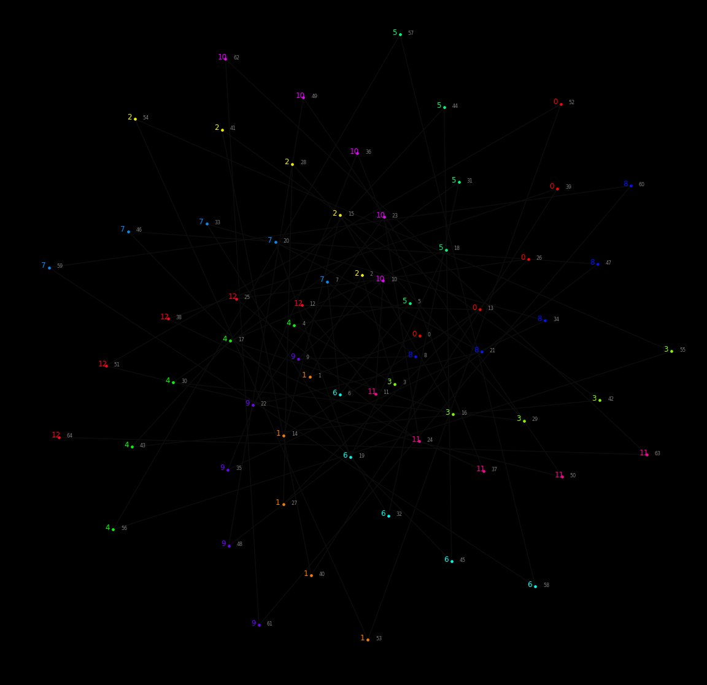
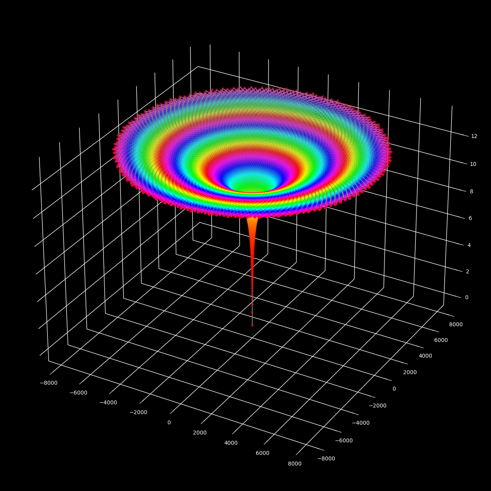
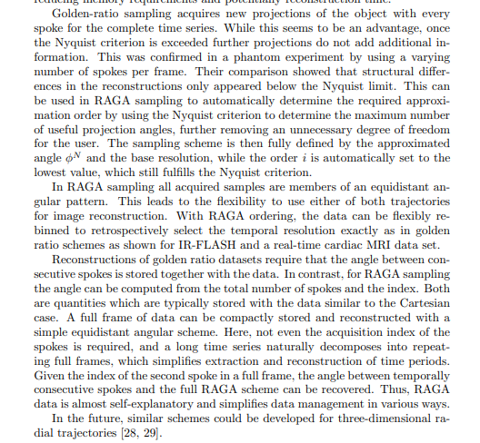

# φ-gons and sampling rate f_s ≈ φ·f

> **Source:** [math.stackexchange.com/q/4931222](https://math.stackexchange.com/q/4931222)  ·  **archived (deleted from MSE)**
> **Tags:** `complex-numbers`, `irrational-numbers`, `sampling-theory`
> **Asked:** 2024-06-15 01:48:57Z

## Question

First thing you realize when playing with certain 2D sequences thought as discrete-time representations of an "unknown" continuous-time function that may not satisfy the time-invariant condition (in the sense of a LTI Linear Time Invariant System), is that the sampling frequency $f_{s} > f$ can be enough because we are using the required 2 correlated samples per $T_{s}$.

How can this fact help in the analysis of predictability of 1D sequences that have a known or suspected origin in trigonometric functions ?

Here I define the basic explanation of the context and a construction I've been playing with and what motivates the question.

# Compressed sensing (edit)

From a real world perspective this is what is as close as possible as an answer.
[Measurements Numbers in Compressed Sensing](https://math.stackexchange.com/questions/4049741/measurements-numbers-in-compressed-sensing)
[https://en.wikipedia.org/wiki/Compressed_sensing](https://en.wikipedia.org/wiki/Compressed_sensing)

"At first glance, compressed sensing might seem to violate the sampling theorem, because compressed sensing depends on the sparsity of the signal in question and not its highest frequency. This is a misconception, because the sampling theorem guarantees perfect reconstruction given sufficient, not necessary, conditions. A sampling method fundamentally different from classical fixed-rate sampling cannot "violate" the sampling theorem. Sparse signals with high frequency components can be highly under-sampled using compressed sensing compared to classical fixed-rate sampling.[10]"

# Rationality of continuous time frequency

We can imagine a continuous-time function as a 2D number like:

$$\theta = e^{\frac{2\pi i}{T}}$$

For simplicity, the continuous-time can be considered as $t \in \mathbb{R}$ and let's add some more restrictions

$$T\ ,\ f \in \mathbb{Q}$$

$$n \in \mathbb{N}_{0}$$

$$q,p\  \in \mathbb{Z}$$

$$T = p/q$$

$$f = 1/T$$

$$\theta^{t} = e^{\frac{2\pi i}{T}t}$$

To get a valid discrete-time sequence representing this continuous time function we need to choose a sampling frequency:

$$f_{s} = \frac{1}{T_{s}}$$

$$\theta^{nT_{s}} = e^{\frac{2\pi i}{T}nT_{s}}$$

$$\theta^{nT_{s}} = e^{\frac{2\pi i}{\frac{T}{T_{s}}}n}$$

So by Nyquist-Shannon sampling theorem we know that to avoid aliasing we need :

$$f_{s} \geq 2f$$

We want $f_{s}$ to be positive integer, allowing us to find an integer period $P$ for our discrete-time signal.

Discrete-time function as a 2D number $\omega$

$$\omega^{n}$$

$$T_{o} \in \mathbb{Q}$$

$$P,k_{o},k\  \in \mathbb{Z}$$

$$T_{o} \geq 2$$

$$T_{o} = \frac{f_{s}}{f} = \frac{T}{T_{s}}$$

$$\omega = e^{\frac{2\pi i}{T_{o}}}$$

$$\theta^{nT_{s}} = e^{\frac{2\pi i}{T_{o}}n} = \omega^{n}$$

$$\omega^{n + P} = \omega^{n}$$

$$\omega^{n}\omega^{P} = \omega^{n}$$

$$\omega^{P} = e^{2k\pi i} = \omega^{kT_{o}}$$

$$P = kT_{o}$$

$$P = k\frac{f_{s}}{f}$$

$$P = k\frac{f_{s}}{\frac{q}{p}}$$

$$P = k\frac{p}{q}f_{s}$$

This is valid por restricted k

$$k = k_{o}q$$

$$P = k_{o}pf_{s}$$

So the periods are going to be affected by the combination of $k_{o},q,p$ and the selected $f_{s}$

# Main string description

Given N - 1 colored symbols describing a curve in space $\overset{\rightarrow}{\mathbf{X}_{\mathbf{n}}}$, created by a single array of complex numbers $Z_{n}$ created recursively.

$$\overset{\rightarrow}{\mathbf{X}_{\mathbf{n}}} = (u_{n},v_{n},w_{n})$$

Considering:
$$n \in \ \mathbb{N}_{0}$$

$$T_{o} \in \ \mathbb{Q}$$

We have

$$r_{k} = \left\{ \begin{matrix}
0 & {k < 0} \\
{r_{k - 1} + \Delta r_{o}} & {\ k \geq 0\text{~and~}k \equiv 0\mspace{8mu}({mod}\mspace{6mu} M)} \\
r_{k - 1} & {\ k > 0\text{~and~}k ≢ 0\mspace{8mu}({mod}\mspace{6mu} M)}
\end{matrix} \right.$$
$$k \in \ \mathbb{Z}$$

So :

$$\omega = e^{\frac{2\pi i}{T_{o}}}$$

$$Z_{n} = r_{n}\omega^{n}$$

## Coloring

The color $C_{n}$ in these examples is based on "hsv" or "coolwarm" colormaps with $M_{c}$ colors:

$$C_{n} \equiv n\quad({mod}\mspace{6mu} M_{c})$$

## Coordinates

And cartesian coordinates for the sequences describing a curve in space:
$$\overset{\rightarrow}{\mathbf{X}_{\mathbf{n}}} = (u_{n},v_{n},w_{n})$$

$$\Omega_{o} = \frac{2\pi}{T_{o}}$$

$$u_{n} = \frac{1}{2}(Z_{n} + \overset{¯}{Z_{n}}) = r_{n}cos(\Omega_{o}n)$$

$$v_{n} = \frac{1}{2i}(Z_{n} - \overset{¯}{Z_{n}}) = r_{n}sin(\Omega_{o}n)$$

$$w_{n} = log_{b}(|Z_{n}|)$$

We have an analogous way to see that:

$$Z_{n} = u_{n} + iv_{n}$$

$$\overset{¯}{Z_{n}} = u_{n} - iv_{n}$$

# The natural numbers represented as colors $C_{n}$ are cyclic and produce an interesting set of loop sequences in the complex plane for the initial example with initial conditions $T_{o} = \varphi$ and $M_{c} = 13$

$$C_{n} \equiv n\quad({mod}\mspace{6mu} M_{c})$$

0,8,3,11,6,1,9,4,12,7,2,10,5 being in A257961 and A025636 maybe explain how n mod 13 worked as a combination machine , being 13 the constant value of the first backward difference of enough order to provide a constant integer sequence?

For loop 0,8,3,11,6,1,9,4,12,7,2,10,5 it's the 3'd order difference that is constant 13.

Being as well the result of adding of the (0+1)th and (13-1)th elements.

-   The same happens in this sequence for the $(0 + k)$th and the $(M_{c} - k)$th elements added are also $M_{c}$

# $M = 1$ $M_{c} = 2584$ and $T_{o} = \frac{2584}{1597}$

This shows how good the approximation of the irrational is, as you get a similar plot as

# Question:

I'd like to know if in the literature this kind of constructions are studied and get some references to interesting reads on the topic. Maybe someone can say that when doing XPSK modulations these tricks are used all the time to manage complexity using dynamic $f_{s}$ values. But I just want reference to pure math literature that discusses this kind of constructions for algebraic numbers and irrationals in general.

## Motivation

If you play with the construction and the colors $C_{n} \equiv n\mspace{8mu}({mod}\mspace{6mu} M_{c})$ you see that for most random values of $M_{c}$ you get noisy and difficult to predict patterns in the colors. Logically being M_c=13 in the Fibonacci sequence you get a nice pattern because of how this particular irrational can be approximated as a rational $T_{n} = F_{n}/F_{n - 1}$. Looking closely on the pattern you realize that doing the 3'd order backward difference the number 13 appears as the first constant sequence.

And that indicates that this pattern is predictable, in the sense that we can construct $M_{c}$ individual spirals that predict them. This means that there is one to one mapping from one domain to the other. Now what happens for other irrationals ? Where can I read more about this?

# Related publications

-   Statistical methods for identification of golden ratio
    [https://www.sciencedirect.com/science/article/abs/pii/S0303264719304459](https://www.sciencedirect.com/science/article/abs/pii/S0303264719304459)

-   Golden Ratio Sequences
    For Low-Discrepancy Sampling
    [https://www.graphics.rwth-aachen.de/media/papers/jgt.pdf](https://www.graphics.rwth-aachen.de/media/papers/jgt.pdf)

-   Rational Approximation of Golden Angles for Simple and Reproducible Radial Sampling
    [https://arxiv.org/html/2401.02892v1](https://arxiv.org/html/2401.02892v1)

"This enables the use of precomputation in reconstruction algorithms, improves numerical robustness, and simplifies data management. A crucial insight was that with the right choice of the spoke increment and total number of spokes, the sampling scheme not only approximates the right angle but also steps through all possible angles of the underlying equidistant sampling scheme.

Although based on a rational approximation, we show that RAGA sampling preserves all important properties of golden ratio sampling. This was demonstrated by calculating and comparing the SPR values of selected irrational angles with their RAGA approximations. For spokes following the corresponding generalized Fibonacci series the SPR values of both schemes are close to the theoretical optimum of the equidistant angular distribution. For spokes in between elements of the generalized Fibonacci series the periodically changing homogeneity in k-space coverage for small angles leads in both schemes to increased SPR values. The approximation accuracy increases fast with the approximation order. For sampling schemes that fulfill the Nyquist criterion for typical base resolutions, the approximation error is lower than one degree. Double golden ratio angles have very similar SPR behavior to similar golden ratio angles and provide an alternative that can be used to distribute the spokes over the full circle without having to artificially increase the index space.

In contrast to golden ratio sampling schemes, RAGA sampling schemes repeat after acquiring a finite number of spokes as defined by the approximation order. This avoids the accumulation of numerical errors over multiple repetitions due to floating point arithmetic. Additionally, the sampling scheme and related quantities such as its PSF can be precomputed and reused in the reconstruction, reducing memory requirements and potentially reconstruction time."
