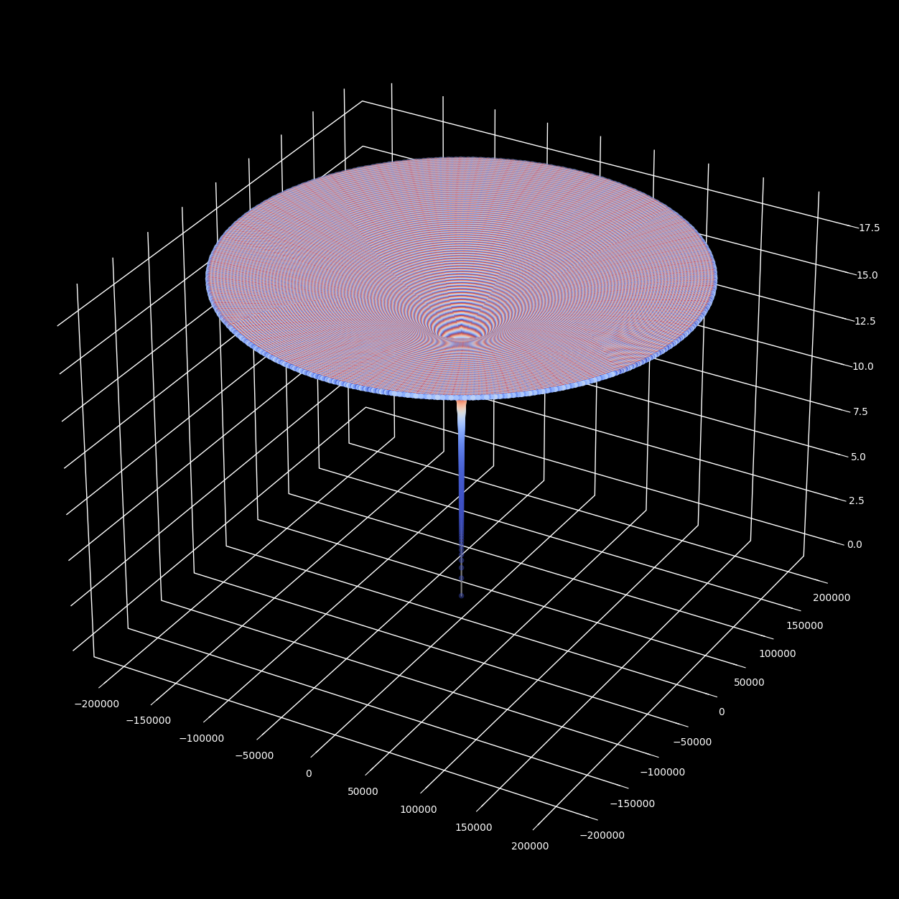
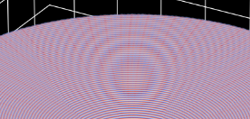

# Moiré pattern in circular-orbits surface

> **Source:** [math.stackexchange.com/q/4974318](https://math.stackexchange.com/q/4974318)  ·  **archived (deleted from MSE)**
> **Tags:** `complex-numbers`, `pattern-recognition`
> **Asked:** 2024-09-21 00:21:08Z

## Question

I was checking some plots I made recently, and a friend pointed out that he saw a Moiré pattern in one of them, and I was explaining him that it wasn't a Moiré pattern trying to interest him in the math behind the plot without success.

But then I realized that maybe he was referring to it as an effect in the plot that can be described and justified mathematically.

The image is this:

If you zoom in you will see circular orbits looking like these Morié pattern:

[https://upload.wikimedia.org/wikipedia/commons/9/97/Moire_Lines.svg](https://upload.wikimedia.org/wikipedia/commons/9/97/Moire_Lines.svg)

The plot is made with these cartesian coordinate sequences:

$$\overset{\rightarrow}{\mathbf{X}_{\mathbf{n}}} = (u_{n},v_{n},w_{n}) = (u_{n},v_{n},f(u_{n},v_{n}))$$

$$\omega = e^{\frac{2\pi i}{T_{o}}}$$

$$r_{k} = \left\{ \begin{matrix}
0 & {k < 0} \\
{r_{k - 1} + \Delta r_{o}} & {\ k \geq 0\text{~and~}k \equiv 0\mspace{8mu}({mod}\mspace{6mu} M)} \\
r_{k - 1} & {\ k > 0\text{~and~}k ≢ 0\mspace{8mu}({mod}\mspace{6mu} M)}
\end{matrix} \right.$$

$$Z_{n} = r_{n}\omega^{n} = u_{n} + iv_{n}$$
$$\overset{¯}{Z_{n}} = r_{n}\omega^{- n} = u_{n} - iv_{n}$$

The color $C_{n}$ is a coolwarm colormap with $M_{c}$ colors, in this example using the index $n$ directly:

$$C_{n} \equiv n\quad({mod}\mspace{6mu} M_{c})$$

$M_{c} = 2584$ and $T_{o} = \frac{1618033988749895}{10^{15}} \approx \varphi$
$$\Omega_{o} = \frac{2\pi}{T_{o}}$$

$$u_{n} = \frac{1}{2}(Z_{n} + \overset{¯}{Z_{n}}) = r_{n}cos(\Omega_{o}n)$$

$$v_{n} = \frac{1}{2i}(Z_{n} - \overset{¯}{Z_{n}}) = r_{n}sin(\Omega_{o}n)$$

$$w_{n} = \frac{log(|Z_{n}|)}{log(2)}$$
