# Prime frequency plots — bi-linear expansion of log(z)

> **Source:** [math.stackexchange.com/q/5119904](https://math.stackexchange.com/q/5119904)  ·  **archived (deleted from MSE)**
> **Tags:** `complex-numbers`, `prime-numbers`, `symmetry`
> **Asked:** 2026-01-27 15:07:49Z

## Question

The question requires some introduction, and I will try to make it as clear and short as possible.

This arises in the context of the informal study of a set of simple symbolic structures in space used to visualize multivariable correlation.

Parallel to the basic calculation of the lags with peaks in correlation, the idea I'm playing with is to investigate families of curves in 2D or 3D that might show that correlation as a graph embedded in an ad-hoc symmetric structure that evolves with the index of the sequence.

## Relation to log(z)

I was playing with the first term of the bilinear expansion of $log(z)$ and realized that it works as a bounded log.

This fit the idea I was playing with of numerical atoms that grow forever but stay contained.

I'm interested in prime hunting techniques and in understanding how the best approximations of $\pi(n)$ were constructed.

[Taylor Series for](https://math.stackexchange.com/questions/585154/taylor-series-for-logx/3535630#3535630)

$$\log(z) = 2\left\lbrack \left( \frac{z - 1}{z + 1} \right) + \frac{1}{3}\left( \frac{z - 1}{z + 1} \right)^{3} + \frac{1}{5}\left( \frac{z - 1}{z + 1} \right)^{5} + \cdots \right\rbrack$$

Converges for $\Re(z) > 0$.

Can the first term of the bilinear be a good enough representation of log(Z) for certain uses?

Consider:

$$r_{n} = \frac{(n - 1)}{(n + 1)} + p_{o}$$

for $n \geq 0 \in \mathbb{N}$ and the first prime as the initial probe $p_{o} = 2$

$$r_{n} = \frac{b_{n}}{q_{n}}$$

The gcd between $b_{n}$ and $q_{n}$ $\in \mathbb{N}$ has to be 1.

I checked if either $b_{n}$ or $q_{n}$ is prime and compared it with the natural density and with different prime frequency expressions based on log() or Li() up to 10\^5.

## filtered for unique prime discovery by $b_{n}$ or $q_{n}$ as a markdown table

  n    b_n   q_n   n_is_prime   pi(n)/n    (Li(n)-0.5Li(sqrt(n)))/n   p_unique   p_unique_cum   p_unique_freq   q_unique   q_unique_cum   q_unique_freq   r_n (decimal)   r_n (fraction)   b_n_is_prime   q_n_is_prime   b_n_cum_primes   b_n_freq   q_n_cum_primes   q_n_freq   either_prime   either_cum_primes   either_freq
  ---- ----- ----- ------------ ---------- -------------------------- ---------- -------------- --------------- ---------- -------------- --------------- --------------- ---------------- -------------- -------------- ---------------- ---------- ---------------- ---------- -------------- ------------------- -------------
  0    1     1     0            \...       \...                       0          0              0.000000        0          0              0.000000        1.000000        1/1              0              0              0                0.000000   0                0.000000   0              0                   0.000000
  1    2     1     0            0.000000   0.000000                   1          1              0.500000        0          0              0.000000        2.000000        2/1              1              0              1                0.500000   0                0.000000   1              1                   0.500000
  2    7     3     1            0.500000   0.548425                   1          2              0.666667        1          1              0.333333        2.333333        7/3              1              1              2                0.666667   1                0.333333   1              2                   0.666667
  3    5     2     1            0.666667   0.619012                   1          3              0.750000        1          2              0.500000        2.500000        5/2              1              1              3                0.750000   2                0.500000   1              3                   0.750000
  4    13    5     0            0.500000   0.611251                   1          4              0.800000        1          3              0.600000        2.600000        13/5             1              1              4                0.800000   3                0.600000   1              4                   0.800000
  5    8     3     1            0.600000   0.590866                   0          4              0.666667        0          3              0.500000        2.666667        8/3              0              1              4                0.666667   4                0.666667   1              5                   0.833333
  6    19    7     0            0.500000   0.569408                   1          5              0.714286        1          4              0.571429        2.714286        19/7             1              1              5                0.714286   5                0.714286   1              6                   0.857143
  7    11    4     1            0.571429   0.549465                   1          6              0.750000        0          4              0.500000        2.750000        11/4             1              0              6                0.750000   5                0.625000   1              7                   0.875000
  8    25    9     0            0.500000   0.531520                   0          6              0.666667        0          4              0.444444        2.777778        25/9             0              0              6                0.666667   5                0.555556   0              7                   0.777778
  9    14    5     0            0.444444   0.515494                   0          6              0.600000        0          4              0.400000        2.800000        14/5             0              1              6                0.600000   6                0.600000   1              8                   0.800000
  10   31    11    0            0.400000   0.501168                   1          7              0.636364        1          5              0.454545        2.818182        31/11            1              1              7                0.636364   7                0.636364   1              9                   0.818182
  11   17    6     1            0.454545   0.488311                   1          8              0.666667        0          5              0.416667        2.833333        17/6             1              0              8                0.666667   7                0.583333   1              10                  0.833333
  12   37    13    0            0.416667   0.476713                   1          9              0.692308        1          6              0.461538        2.846154        37/13            1              1              9                0.692308   8                0.615385   1              11                  0.846154

### Question 1

Why are $q_{n}$ unique prime events matching so perfectly the real frequency?
It looks like $b_{n}$ is the same shape but shifted

[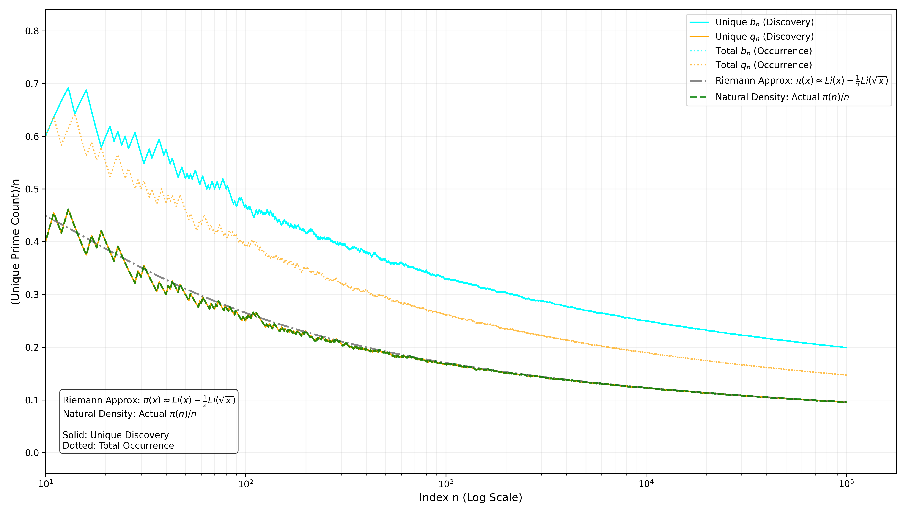](https://i.sstatic.net/nSvg0aBP.png)

This was answered by Thomas in the comments:

If n is odd

$$b_{n} = \frac{(p_{o} + 1)n + (p_{o} - 1)}{2}$$

$$q_{n} = \frac{n + 1}{2}$$

Otherwise

$$b_{n} = (p_{o} + 1)n + p_{o} - 1$$

$$q_{n} = n + 1$$

So $q_{n}$ behaves like $n$.

## Question 2

Consider a hexagonal spiral with a radius $r_{n}$ that grows forever but never reaches 3.

$$r_{n} = \frac{(n - 1)}{(n + 1)} + p_{o}$$
$$r_{n}\omega^{n}$$
$$\omega = e^{\frac{2\pi i}{T_{o}}}$$
$$s_{n} = r_{n}\omega^{n}$$

### Plot of the oscillation between primes that are either 1 or 5 modulo 6

-   The gray lines are between consecutive number events starting from 1

-   The red lines are between consecutive prime number events

This graph shows that all primes $p \geq 5$ are either $p \equiv 5\mspace{12mu}{mod}\,\, 6$ or $p \equiv 1\mspace{12mu}{mod}\,\, 6$
I'm aware this is a known simple fact based on realizing that if a number is $0;2;4\mspace{12mu}{mod}\,\, 6$ is even and if it's $3\mspace{12mu}{mod}\,\, 6$ it's divisible by 3, so that leaves us with only $1$ or $5$ as options.

I wasn't aware of this fact, until it became obvious while playing with more symmetries added to the following plot.
In this plot the behavior of prime events transitions after 5 becomes binary with 4 possible transitions: $1\rightarrow 1$; $1\rightarrow 5$; $5\rightarrow 1$; $5\rightarrow 5$.

Is the distribution across these $2^{2}$ possible transitions known. Should it be flat? It looks there is an initial bias towards "polar" transitions between $1\rightarrow 5$ and $5\rightarrow 1$ when tested up to $10^{5}$.
$$\begin{matrix}
{1\rightarrow 1} &  \\
{1\rightarrow 5} &  \\
{5\rightarrow 1} &  \\
{5\rightarrow 5} &
\end{matrix}$$

Can we expect to find predictive patterns (of the same kind as before with initial spikes in the densities) by playing with another starting probe prime different than $p_{o} = 2$ and trying, for example, $p_{o} = 2^{136279841} - 1$ or a **known big prime that is either 1 or 5 modulo 6**? I found that for manageable sizes it's easy to predict when the next prime event is about to happen if you start with the right $p_{o}$ and see the animation without the numbers in it and superposed orbits of $r_{n}\omega^{b_{n}}$ as a dummy prime predictor.
You can test it by converting these plots into animations that go at the desired frame rate or add step-by-step functionality.

[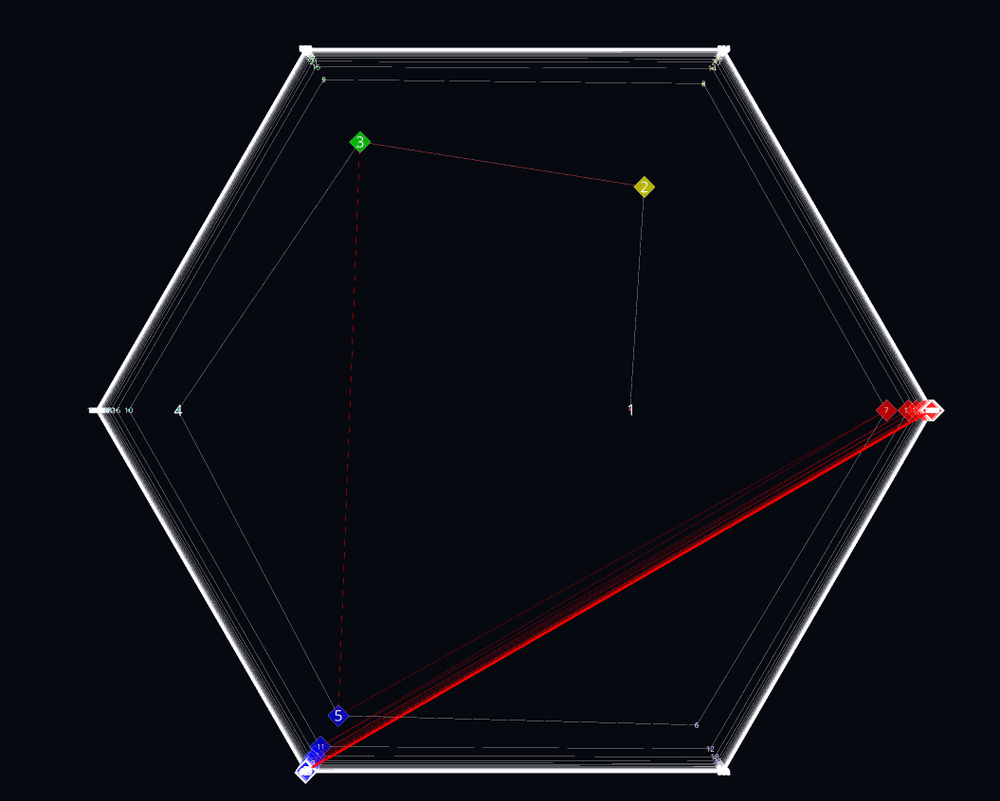](https://i.sstatic.net/KnSxmHeG.png)

#### Colored transitions

[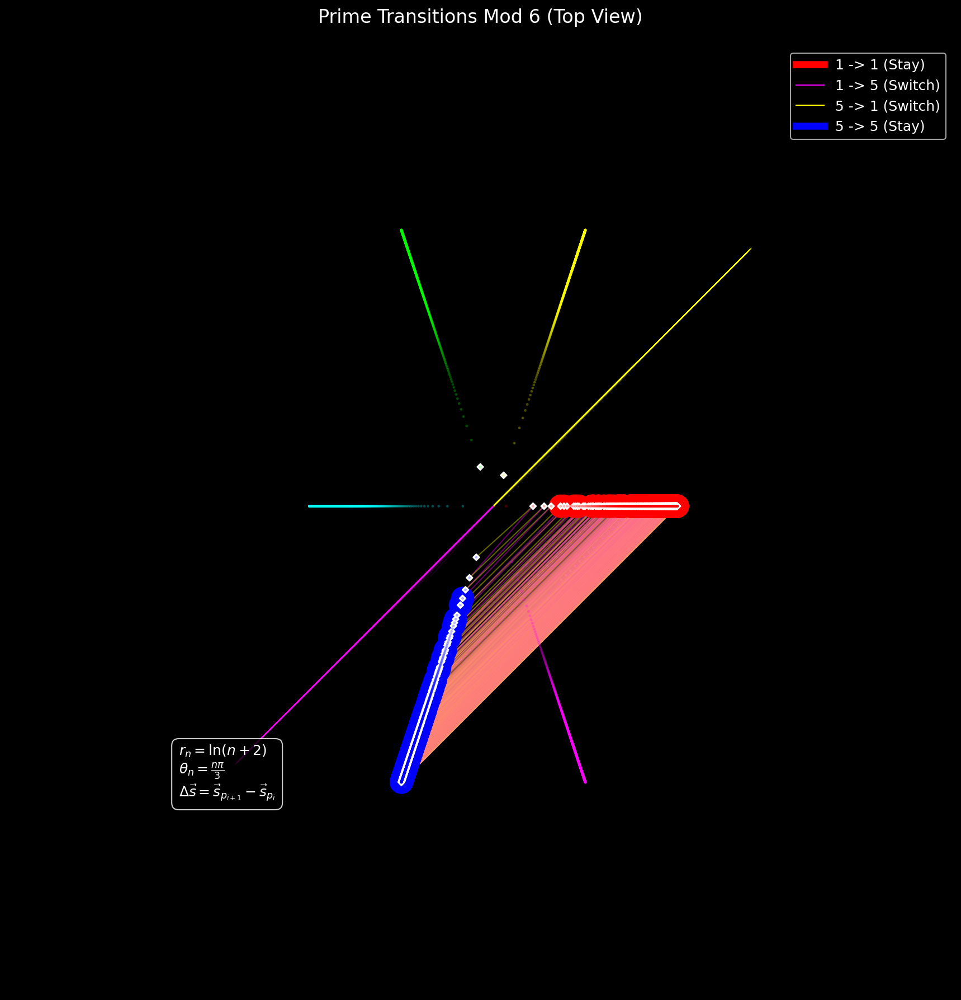](https://i.sstatic.net/TpKQgDlJ.png)
[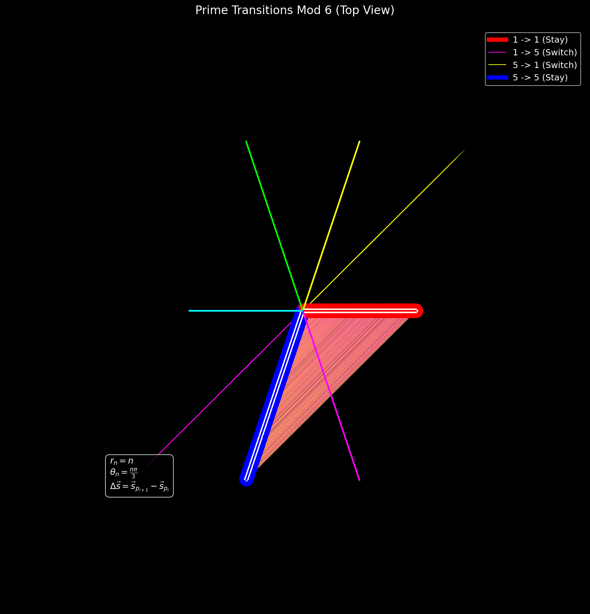](https://i.sstatic.net/bJymv9Ur.png)

## A periodic table for numbers with it's microscope

The last plot is the top view of the $\overset{\rightarrow}{A_{n}}$ curve of the following atomic shape that emerges from the act of counting with $T_{o} = 6$, coloring modulo 6 with $M_{c} = 6$ different colors so color $C_{n} \equiv n\mspace{12mu}{mod}\,\, M_{c}$:

$$\overset{\rightarrow}{\mathbf{A}_{\mathbf{n}}} = (u_{n},v_{n},w_{n})$$

$$\Omega_{o} = \frac{2\pi}{T_{o}}$$

And the spatial coordinates arrays for index $n$

$$u_{n} = \frac{1}{2}(s_{n} + \overset{¯}{s_{n}}) = r_{n}\cos(\Omega_{o}n)$$

$$v_{n} = \frac{1}{2i}(s_{n} - \overset{¯}{s_{n}}) = r_{n}\sin(\Omega_{o}n)$$

$$w_{n} = r_{n}$$

## Atomic structure created by 48 reflections of a main guide curve

Can playing with structures like this help in the quest of predicting the next primes for manageable sizes?

I see superposed orbits that may or may not have some information associated with them that can be thought of as "interactions" between numbers, especially the red line prime oscillation inside the eternally growing bounded log radius hexagon.

#### $F_{0}$

-   xyz x4

$$\overset{\rightarrow}{A_{n}} = (u_{n},v_{n},w_{n})$$

$$\overset{\rightarrow}{B_{n}} = (u_{n}, - v_{n},w_{n})$$

$$\overset{\rightarrow}{C_{n}} = ( - u_{n},v_{n},w_{n})$$

$$\overset{\rightarrow}{D_{n}} = ( - u_{n}, - v_{n},w_{n})$$

-   yxz x4

$$\overset{\rightarrow}{E_{n}} = (v_{n},u_{n},w_{n})$$

$$\overset{\rightarrow}{F_{n}} = (v_{n}, - u_{n},w_{n})$$

$$\overset{\rightarrow}{G_{n}} = ( - v_{n},u_{n},w_{n})$$

$$\overset{\rightarrow}{H_{n}} = ( - v_{n}, - u_{n},w_{n})$$

#### $F_{1}$

-   xy(-z) x4
    $$\overset{\rightarrow}{I_{n}} = (u_{n},v_{n}, - w_{n})$$

$$\overset{\rightarrow}{J_{n}} = (u_{n}, - v_{n}, - w_{n})$$

$$\overset{\rightarrow}{K_{n}} = ( - u_{n},v_{n}, - w_{n})$$

$$\overset{\rightarrow}{L_{n}} = ( - u_{n}, - v_{n}, - w_{n})$$

-   yx(-z) x4
    $$\overset{\rightarrow}{M_{n}} = (v_{n},u_{n}, - w_{n})$$

$$\overset{\rightarrow}{N_{n}} = (v_{n}, - u_{n}, - w_{n})$$

$$\overset{\rightarrow}{O_{n}} = ( - v_{n},u_{n}, - w_{n})$$

$$\overset{\rightarrow}{b_{n}} = ( - v_{n}, - u_{n}, - w_{n})$$

#### $F_{2}$

-   zxy x4

$$\overset{\rightarrow}{Q_{n}} = (w_{n},u_{n},v_{n})$$

$$\overset{\rightarrow}{R_{n}} = (w_{n},u_{n}, - v_{n})$$

$$\overset{\rightarrow}{S_{n}} = (w_{n}, - u_{n},v_{n})$$

$$\overset{\rightarrow}{T_{n}} = (w_{n}, - u_{n}, - v_{n})$$

-   zyx x4

$$\overset{\rightarrow}{U_{n}} = (w_{n},v_{n},u_{n})$$

$$\overset{\rightarrow}{V_{n}} = (w_{n},v_{n}, - u_{n})$$

$$\overset{\rightarrow}{W_{n}} = (w_{n}, - v_{n},u_{n})$$

$$\overset{\rightarrow}{X_{n}} = (w_{n}, - v_{n}, - u_{n})$$

#### $F_{3}$

-   (-z)xy x4

$$\overset{\rightarrow}{\alpha_{n}} = ( - w_{n},u_{n},v_{n})$$

$$\overset{\rightarrow}{\beta_{n}} = ( - w_{n},u_{n}, - v_{n})$$

$$\overset{\rightarrow}{\gamma_{n}} = ( - w_{n}, - u_{n},v_{n})$$

$$\overset{\rightarrow}{\delta_{n}} = ( - w_{n}, - u_{n}, - v_{n})$$

-   (-z)yx x4

$$\overset{\rightarrow}{\epsilon_{n}} = ( - w_{n},v_{n},u_{n})$$

$$\overset{\rightarrow}{\zeta_{n}} = ( - w_{n},v_{n}, - u_{n})$$

$$\overset{\rightarrow}{\eta_{n}} = ( - w_{n}, - v_{n},u_{n})$$

$$\overset{\rightarrow}{\theta_{n}} = ( - w_{n}, - v_{n}, - u_{n})$$

#### $F_{4}$

-   xzy x4

$$\overset{\rightarrow}{\iota_{n}} = (u_{n},w_{n},v_{n})$$

$$\overset{\rightarrow}{\kappa_{n}} = (u_{n},w_{n}, - v_{n})$$

$$\overset{\rightarrow}{\lambda_{n}} = ( - u_{n},w_{n},v_{n})$$

$$\overset{\rightarrow}{\mu_{n}} = ( - u_{n},w_{n}, - v_{n})$$

-   yzx x4

$$\overset{\rightarrow}{\nu_{n}} = (v_{n},w_{n},u_{n})$$

$$\overset{\rightarrow}{\xi_{n}} = (v_{n},w_{n}, - u_{n})$$

$$\overset{\rightarrow}{O_{n}} = ( - v_{n},w_{n},u_{n})$$

$$\overset{\rightarrow}{\pi_{n}} = ( - v_{n},w_{n}, - u_{n})$$

#### $F_{5}$

-   x(-z)y x4

$$\overset{\rightarrow}{\rho_{n}} = (u_{n}, - w_{n},v_{n})$$

$$\overset{\rightarrow}{\sigma_{n}} = (u_{n}, - w_{n}, - v_{n})$$

$$\overset{\rightarrow}{\tau_{n}} = ( - u_{n}, - w_{n},v_{n})$$

$$\overset{\rightarrow}{\upsilon_{n}} = ( - u_{n}, - w_{n}, - v_{n})$$

-   y(-z)x x4

$$\overset{\rightarrow}{\phi_{n}} = (v_{n}, - w_{n},u_{n})$$

$$\overset{\rightarrow}{\chi_{n}} = (v_{n}, - w_{n}, - u_{n})$$

$$\overset{\rightarrow}{\psi_{n}} = ( - v_{n}, - w_{n},u_{n})$$

$$\overset{\rightarrow}{\omega_{n}} = ( - v_{n}, - w_{n}, - u_{n})$$

## Some examples of atoms for different numbers following the previous logic

The same $s_{n}$ as in the hexagon plot of one curve, but now with its 47 reflections added, seen in 3 dimensions.

### Atom for $N = 1000$ with $T_{o} = 6$ and $M_{c} = 6$

[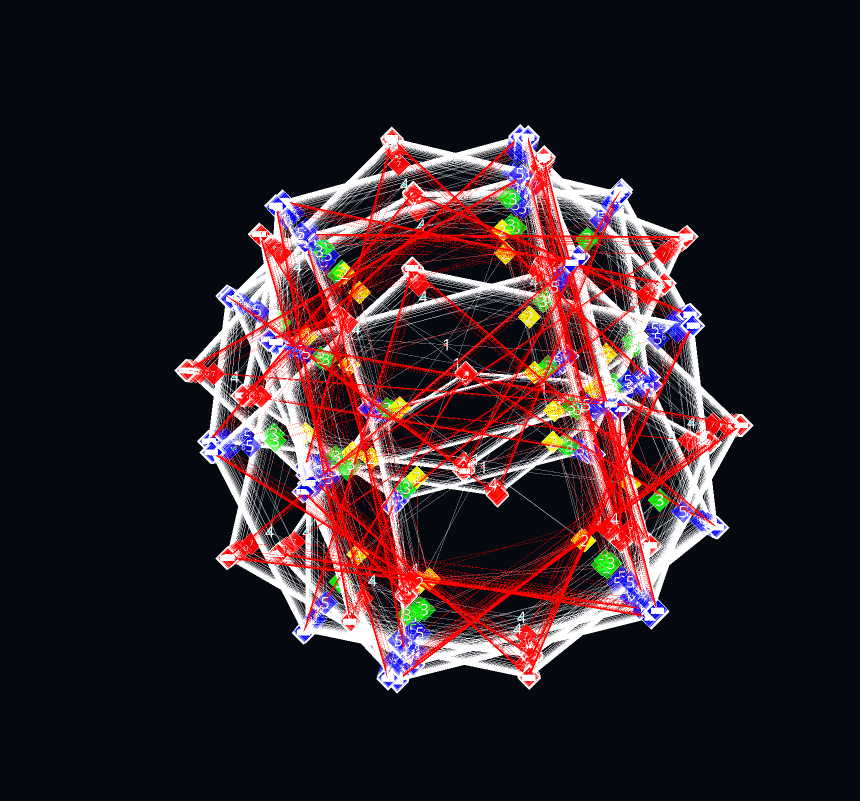](https://i.sstatic.net/pzIyqx9f.png)

### View from inside of the previous atom

[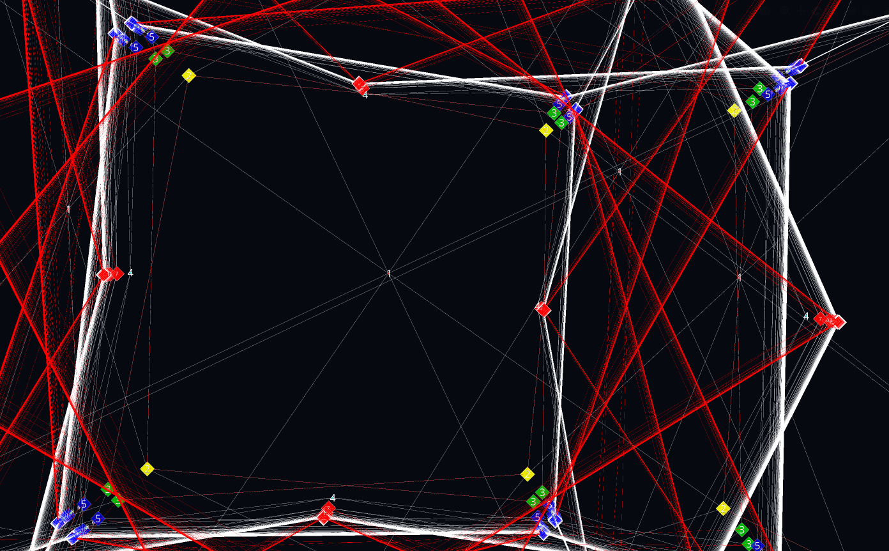](https://i.sstatic.net/OPgiMO18.png)

### Better view of the same structure without prime oscillations

[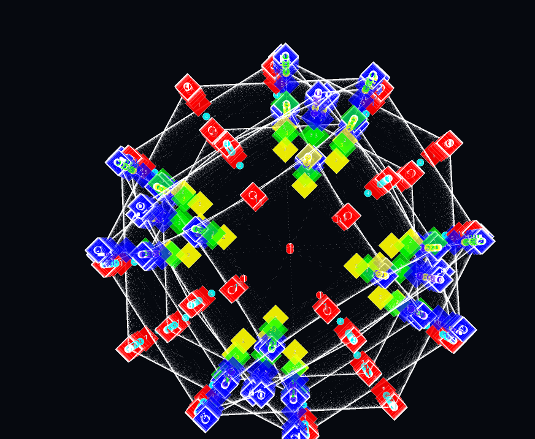](https://i.sstatic.net/JLNPWY2C.png)

### Now using an irrational $T_{o} = \varphi$ and with $n$ up to $N = 39$ and then $N = 1000$

Using an irrational number approximation as $T_{o}$ will create a pattern that as $N\rightarrow\infty$ eventually fills a radius 3 circumference with the visualized events. Events in this case are primes, but we could be working with any kind of event observed in any kind of sequence.

[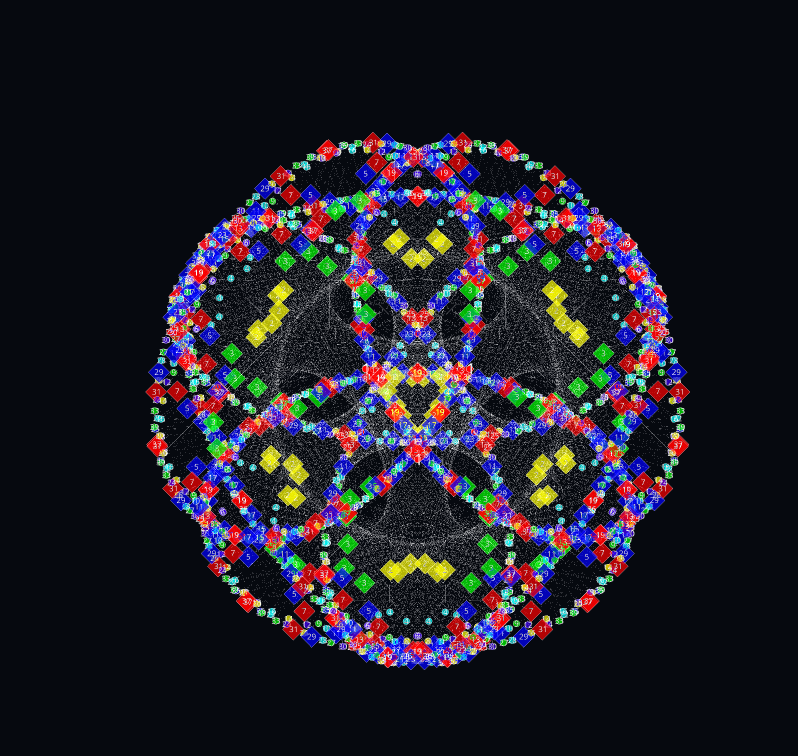](https://i.sstatic.net/82Ni4hmT.png)

[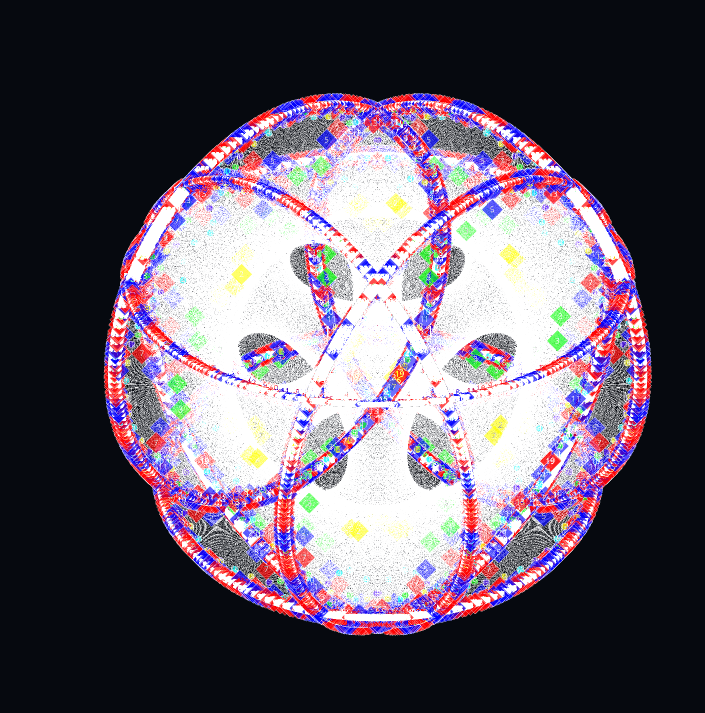](https://i.sstatic.net/CbeDfGqr.png)

[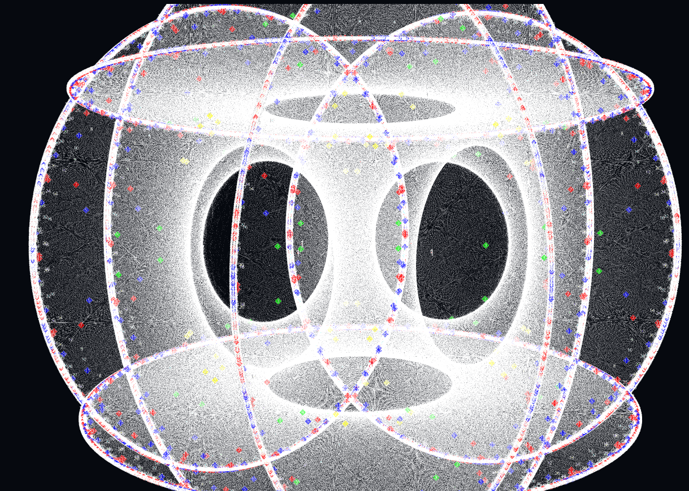](https://i.sstatic.net/gYVCB9OI.png)

### ${\overset{\rightarrow}{A}}_{n}$ top view with $C_{n} \equiv n\mspace{12mu}{mod}\,\, 18$ with smoothed $r_{n}$, $M = 1$ and irrational $T_{o} = \varphi$

$$r_{k} = \left\{ \begin{matrix}
0 & {k < 0} \\
{r_{k - 1} + \Delta r_{o}} & {k \geq 0\text{~and~}k \equiv 0\mspace{8mu}({mod}\mspace{6mu} M)} \\
r_{k - 1} & {k > 0\text{~and~}k ≢ 0\mspace{8mu}({mod}\mspace{6mu} M)}
\end{matrix} \right.$$
$$u_{n} = \frac{1}{2}(s_{n} + \overset{¯}{s_{n}}) = r_{n}\cos(\Omega_{o}n)$$

$$v_{n} = \frac{1}{2i}(s_{n} - \overset{¯}{s_{n}}) = r_{n}\sin(\Omega_{o}n)$$

$$w_{n} = \log_{2}(|s_{n}|)$$

[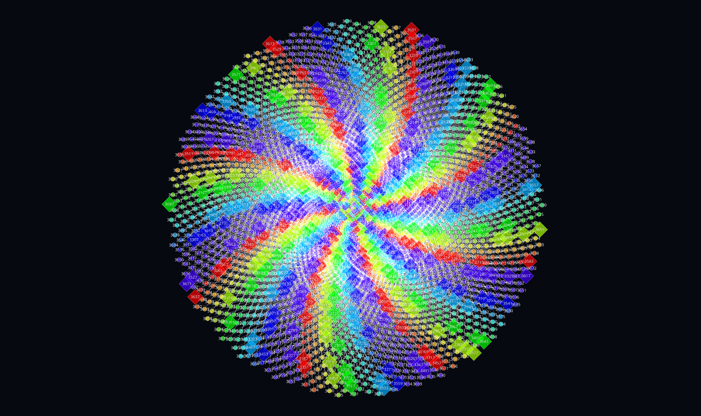](https://i.sstatic.net/zODRVcm5.png)

### Added prime oscillations

[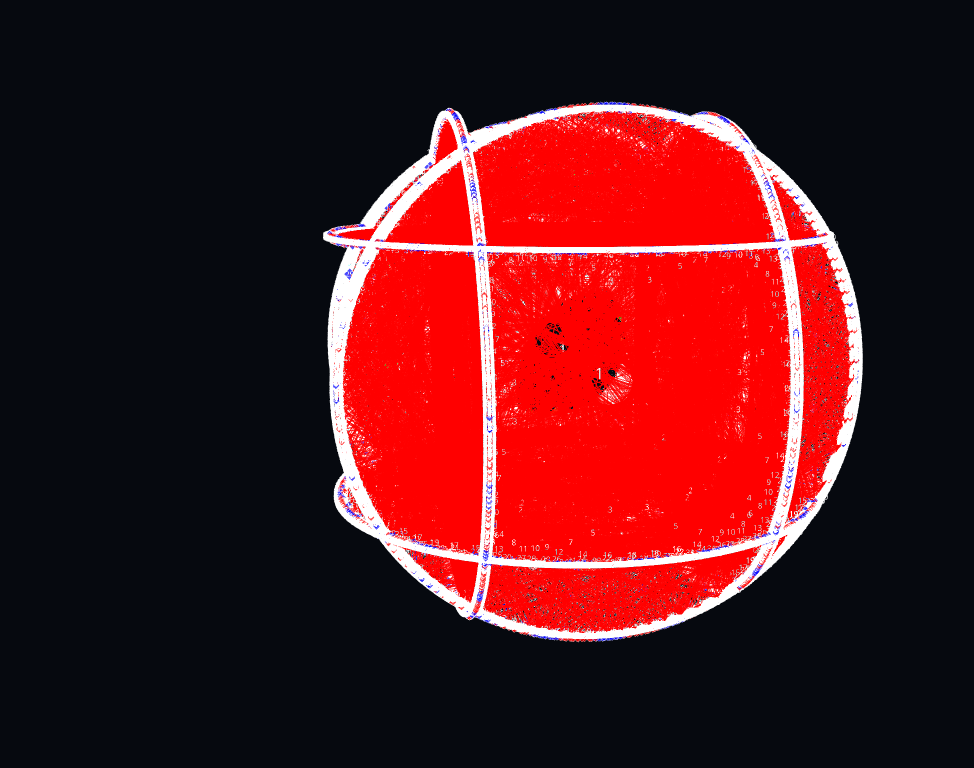](https://i.sstatic.net/pz9evDYf.png)

#### From the inside of previous plot

What is the radius of this emergent circumference?

[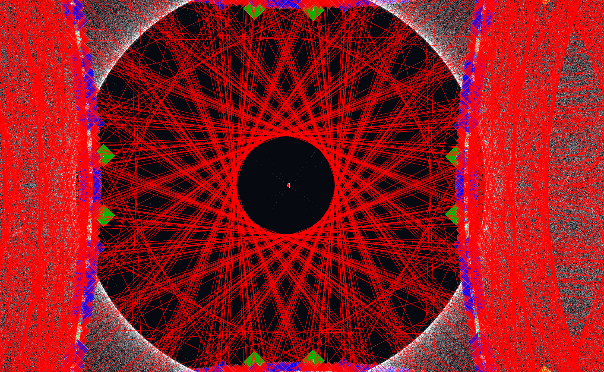](https://i.sstatic.net/zOCUFID5.png)

---

## Answers (1)

### Answer by fbatrouni  · score 0

The last month I spent a lot of time trying to answer the obvious parts of the question. I realized that trying to hunt primes blindly or leveraging obvious correlations in 2D is not that interesting if you don't really understand what the act of "factorization" means when you are counting. It's a code that organizes numbers according to different properties.

So my answer will focus on addressing the main points I could discover to answer the question of what residue class could be more fruitful, and here I will compare mod 6 and mod 10.

Mod 10 will organize, as expected the numbers based on their last digit and makes the golden ratio appear, and mod 6 makes the "complex golden ratio" appear.

[Imaginary Golden Ratio](https://math.stackexchange.com/questions/1851698/imaginary-golden-ratio)

But first, we do factorization from scratch:

Consider a number $n$ with its prime factorization given by a dual representation as follows:

Using $\omega = e^{2\pi i/T_{o}}$ based on the values (periods $T_{o} = 10$ and $T_{o} = 6$). Primes $p$ always correspond to single vectors $\omega^{p}$, so $|s_{p}| = |{\overset{˙}{s}}_{p}| = |\omega^{p}| = 1$.

-   $s_{n}$: Sum over prime factors with multiplicity ($b_{k}$).

$$n = \prod\limits_{k = 1}^{M_{n}}b_{k}\;\Longrightarrow\; s_{n} = \sum\limits_{k = 1}^{M_{n}}\omega^{b_{k}}$$

-   ${\overset{˙}{s}}_{n}$: Sum over distinct prime factors ($d_{k}$).

$$\lbrack d_{1},d_{2},\ldots,d_{m_{n}}\rbrack\text{~are the distinct prime factors}\;\Longrightarrow\;{\overset{˙}{s}}_{n} = \sum\limits_{k = 1}^{m_{n}}\omega^{d_{k}}$$

Based on these two simple representations of the factorization process, some conclusions can be derived that, in my ignorance about deep math as an engineer, I find really beautiful because I find them meaningful.

Example for $n = 60$:
$$60 = 2^{2} \cdot 3^{1} \cdot 5^{1}$$

-   $b_{k} = \lbrack 2,2,3,5\rbrack\;\Longrightarrow\; M_{60} = 4$
-   $d_{k} = \lbrack 2,3,5\rbrack\;\Longrightarrow\; m_{60} = 3$
-   $e_{k} = \lbrack 2,1,1\rbrack\;\Longrightarrow\;\sum e_{k} = 2 + 1 + 1 = 4 = M_{60}$
    $$s_{60} = \omega^{2} + \omega^{2} + \omega^{3} + \omega^{5},\quad{\overset{˙}{s}}_{60} = \omega^{2} + \omega^{3} + \omega^{5},\quad{\overset{¨}{s}}_{60} = \omega^{4} + \omega^{3} + \omega^{5}$$

When you see a lot of $\sqrt{5}$ and a lot of $618$ in the decimal of your tables the golden ratio is always around, so:

## The modulus of $s_{n}$ sieves primes in 2D naturally by simple factorization

  $n$   Prime   Factorization   $s_{n}$                     ${\overset{˙}{s}}_{n}$
  ----- ------- --------------- --------------------------- ---------------------------
  1             $1$             $0$                         $0$
  2     ✓       $2$             $\omega^{2}$                $\omega^{2}$
  3     ✓       $3$             $\omega^{3}$                $\omega^{3}$
  4             $2^{2}$         $2\omega^{2}$               $\omega^{2}$
  5     ✓       $5$             $\omega^{5}$                $\omega^{5}$
  6             $2 \cdot 3$     $\omega^{2} + \omega^{3}$   $\omega^{2} + \omega^{3}$
  7     ✓       $7$             $\omega^{7}$                $\omega^{7}$

### Mod 10

    $n$ ${Re}(s_{n})$                ${Im}(s_{n})$                                         ${Re}({\overset{˙}{s}}_{n})$   ${Im}({\overset{˙}{s}}_{n})$
  ----- ---------------------------- ----------------------------------------------------- ------------------------------ -----------------------------------------------------
      1 $0$                          $0$                                                   $0$                            $0$
      2 $\frac{\varphi - 1}{2}$      $\frac{\sqrt{2 + \varphi}}{2}$                        $\frac{\varphi - 1}{2}$        $\frac{\sqrt{2 + \varphi}}{2}$
      3 $\frac{- \varphi + 1}{2}$    $\frac{\sqrt{2 + \varphi}}{2}$                        $\frac{- \varphi + 1}{2}$      $\frac{\sqrt{2 + \varphi}}{2}$
      4 $\varphi - 1$                $\sqrt{2 + \varphi}$                                  $\frac{\varphi - 1}{2}$        $\frac{\sqrt{2 + \varphi}}{2}$
      5 $- 1$                        $0$                                                   $- 1$                          $0$
      6 $0$                          $\sqrt{2 + \varphi}$                                  $0$                            $\sqrt{2 + \varphi}$
      7 $\frac{- \varphi + 1}{2}$    $- \frac{\sqrt{2 + \varphi}}{2}$                      $\frac{- \varphi + 1}{2}$      $- \frac{\sqrt{2 + \varphi}}{2}$
      8 $\frac{3\varphi - 3}{2}$     $\frac{3\sqrt{2 + \varphi}}{2}$                       $\frac{\varphi - 1}{2}$        $\frac{\sqrt{2 + \varphi}}{2}$
      9 $- \varphi + 1$              $\sqrt{2 + \varphi}$                                  $\frac{- \varphi + 1}{2}$      $\frac{\sqrt{2 + \varphi}}{2}$
     10 $\frac{\varphi - 3}{2}$      $\frac{\sqrt{2 + \varphi}}{2}$                        $\frac{\varphi - 3}{2}$        $\frac{\sqrt{2 + \varphi}}{2}$
     11 $\frac{\varphi}{2}$          $\frac{\sqrt{3 - \varphi}}{2}$                        $\frac{\varphi}{2}$            $\frac{\sqrt{3 - \varphi}}{2}$
     12 $\frac{\varphi - 1}{2}$      $\frac{3\sqrt{2 + \varphi}}{2}$                       $0$                            $\sqrt{2 + \varphi}$
     13 $\frac{- \varphi + 1}{2}$    $\frac{\sqrt{2 + \varphi}}{2}$                        $\frac{- \varphi + 1}{2}$      $\frac{\sqrt{2 + \varphi}}{2}$
     14 $0$                          $0$                                                   $0$                            $0$
     15 $- \frac{\varphi + 1}{2}$    $\frac{\sqrt{2 + \varphi}}{2}$                        $- \frac{\varphi + 1}{2}$      $\frac{\sqrt{2 + \varphi}}{2}$
     16 $2\varphi - 2$               $2\sqrt{2 + \varphi}$                                 $\frac{\varphi - 1}{2}$        $\frac{\sqrt{2 + \varphi}}{2}$
     17 $\frac{- \varphi + 1}{2}$    $- \frac{\sqrt{2 + \varphi}}{2}$                      $\frac{- \varphi + 1}{2}$      $- \frac{\sqrt{2 + \varphi}}{2}$
     18 $\frac{- \varphi + 1}{2}$    $\frac{3\sqrt{2 + \varphi}}{2}$                       $0$                            $\sqrt{2 + \varphi}$
     19 $\frac{\varphi}{2}$          $- \frac{\sqrt{3 - \varphi}}{2}$                      $\frac{\varphi}{2}$            $- \frac{\sqrt{3 - \varphi}}{2}$
     20 $\varphi - 2$                $\sqrt{2 + \varphi}$                                  $\frac{\varphi - 3}{2}$        $\frac{\sqrt{2 + \varphi}}{2}$
     21 $- \varphi + 1$              $0$                                                   $- \varphi + 1$                $0$
     22 $\frac{2\varphi - 1}{2}$     $\frac{\sqrt{2 + \varphi} + \sqrt{3 - \varphi}}{2}$   $\frac{2\varphi - 1}{2}$       $\frac{\sqrt{2 + \varphi} + \sqrt{3 - \varphi}}{2}$
     23 $\frac{- \varphi + 1}{2}$    $\frac{\sqrt{2 + \varphi}}{2}$                        $\frac{- \varphi + 1}{2}$      $\frac{\sqrt{2 + \varphi}}{2}$
     24 $\varphi - 1$                $2\sqrt{2 + \varphi}$                                 $0$                            $\sqrt{2 + \varphi}$
     25 $- 2$                        $0$                                                   $- 1$                          $0$
     26 $0$                          $\sqrt{2 + \varphi}$                                  $0$                            $\sqrt{2 + \varphi}$
     27 $\frac{- 3\varphi + 3}{2}$   $\frac{3\sqrt{2 + \varphi}}{2}$                       $\frac{- \varphi + 1}{2}$      $\frac{\sqrt{2 + \varphi}}{2}$
     28 $\frac{\varphi - 1}{2}$      $\frac{\sqrt{2 + \varphi}}{2}$                        $0$                            $0$
     29 $\frac{\varphi}{2}$          $- \frac{\sqrt{3 - \varphi}}{2}$                      $\frac{\varphi}{2}$            $- \frac{\sqrt{3 - \varphi}}{2}$
     30 $- 1$                        $\sqrt{2 + \varphi}$                                  $- 1$                          $\sqrt{2 + \varphi}$
     31 $\frac{\varphi}{2}$          $\frac{\sqrt{3 - \varphi}}{2}$                        $\frac{\varphi}{2}$            $\frac{\sqrt{3 - \varphi}}{2}$
     32 $\frac{5\varphi - 5}{2}$     $\frac{5\sqrt{2 + \varphi}}{2}$                       $\frac{\varphi - 1}{2}$        $\frac{\sqrt{2 + \varphi}}{2}$
     33 $\frac{1}{2}$                $\frac{\sqrt{2 + \varphi} + \sqrt{3 - \varphi}}{2}$   $\frac{1}{2}$                  $\frac{\sqrt{2 + \varphi} + \sqrt{3 - \varphi}}{2}$
     34 $0$                          $0$                                                   $0$                            $0$
     35 $- \frac{\varphi + 1}{2}$    $- \frac{\sqrt{2 + \varphi}}{2}$                      $- \frac{\varphi + 1}{2}$      $- \frac{\sqrt{2 + \varphi}}{2}$
     36 $0$                          $2\sqrt{2 + \varphi}$                                 $0$                            $\sqrt{2 + \varphi}$
     37 $\frac{- \varphi + 1}{2}$    $- \frac{\sqrt{2 + \varphi}}{2}$                      $\frac{- \varphi + 1}{2}$      $- \frac{\sqrt{2 + \varphi}}{2}$

### Plots Mod 10

#### Process

[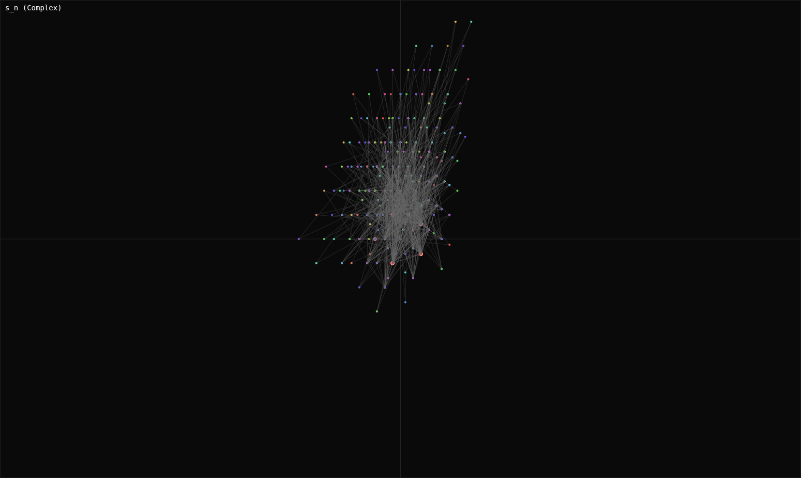](https://i.sstatic.net/eAqdwTHv.png)

#### mod 10 with primes highlighted using mod 6 color

-   Red points are the unique prime positions in 2D for the set of possible last digits of $n$ organized by that last digit. Oscillations between the obvious $1,3,7,9$ are expected, but extra information might be given by the construction.

For primes $p \geq 5$, only four last digits are possible: $\{ 1,3,7,9\}$.

Each maps to a fixed angle on the unit circle. Including small primes $2,3,5$:

[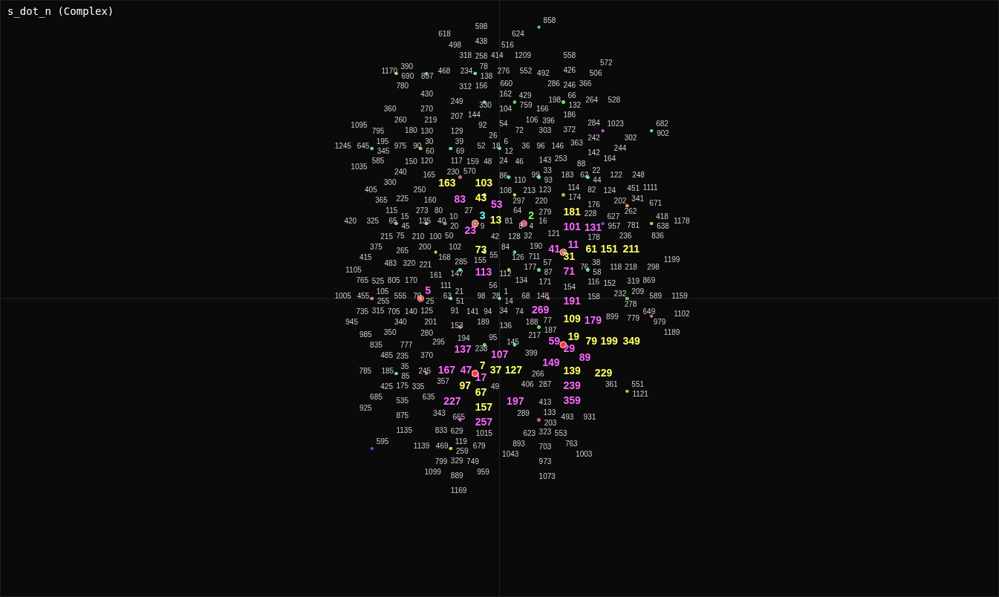](https://i.sstatic.net/46bNInLj.png)

#### The modulus of $s_{n}$ seems to be bounded by $2^{a}$

[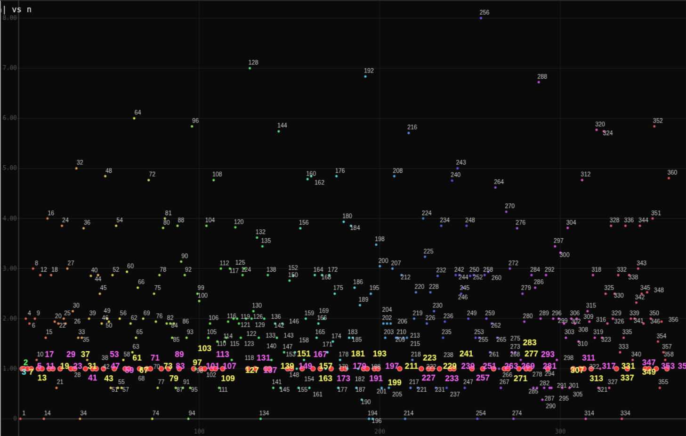](https://i.sstatic.net/JHHtTO2C.png)

#### ${\overset{˙}{s}}_{n}$ mod 10

It seems to group twin primes

[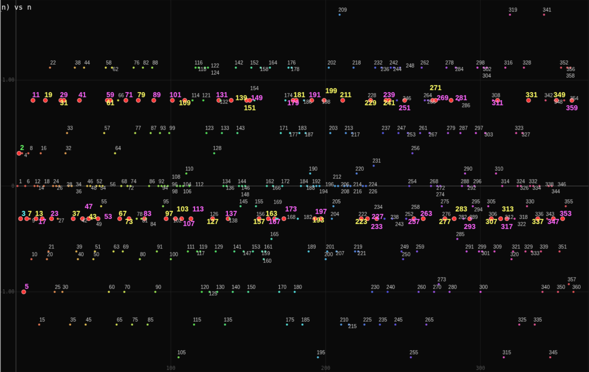](https://i.sstatic.net/xFjBUA7i.png)

## A1: So yes, there is some information in space encoded in the simple act of counting and factorizing

But the weeds are deep and I've been way over my head in the literature I read just to not reinvent the wheel, and now I'm a little more familiar with basic primes literature that explores primes over residue classes.

For example this paper explores formally the bias in the transitions of primes from 1 to -1 mod 6

[https://www.pnas.org/doi/10.1073/pnas.1605366113](https://www.pnas.org/doi/10.1073/pnas.1605366113)

## A2: Predictive patterns

If any construction really predicts something there are many ways to test it. I'm not that skilled or at the level that I'm interested on testing predictions, I'm more interested on thinking if we had the 2D representation of the plots without the labels how we can go back to the number n it represents.
One would be try to predict this natural $s_{n}$ or its variations, and compare it with the simpler construction in the question. Or to predict the symbolic table representation as variations of multiples of $\sqrt{5}$ for the mod 10 case and of $\sqrt{3}$ for the mod 6 case

#### Some conclusions mod 10

Symmetries: conjugate pairs and $\omega^{5} = - 1$

The four prime angles (for $p \geq 5$) pair into conjugates:

-   $\omega^{1}$ and $\omega^{9}$ are conjugates ($36{^\circ} + 324{^\circ} = 360{^\circ}$)
-   $\omega^{3}$ and $\omega^{7}$ are conjugates ($108{^\circ} + 252{^\circ} = 360{^\circ}$)

Also: $\omega^{5} = e^{i\pi} = - 1$, so $\omega^{a + 5} = - \omega^{a}$ (antipodal on the circle).
$s_{n} = \sum\omega^{b_{k}}$ and each $\omega^{b_{k}} = \omega^{b_{k}\operatorname{mod}10}$

By the beautiful Dirichlet's theorem on primes in arithmetic progressions, for each residue class $a \in \{ 1,3,7,9\}$, the density of primes $p \equiv a\mspace{8mu}({mod}\mspace{6mu} 10)$ is $\frac{1}{\varphi(10)} = \frac{1}{4}$.

Among prime last digits $\{ 1,2,3,5,7,9\}$, the only viable antipodal pair seems to be $\{ 2,7\}$.

Semiprimes 2 × (prime ending in 7) give s_n = 0
[14, 34, 74, 94, 134, 194, 214, 254, 274, 314]\...

Type B: 5th-root-of-unity cancellations

Beyond pairwise $(2\leftrightarrow 7)$, another way to get $s_{n} = 0$ uses the identity:

$$\sum\limits_{k = 0}^{4}(\omega^{2})^{k} = 1 + \omega^{2} + \omega^{4} + \omega^{6} + \omega^{8} = 0$$

(sum of all 5th roots of unity, since $\omega^{2}$ is a primitive 5th root).

Multiplying by $\omega$:
$$\omega + \omega^{3} + \omega^{5} + \omega^{7} + \omega^{9} = 0$$

The odd residues mod 10 form a rotated set of 5th roots!

## Now the beauty primes mod 6

    $n$ ${Re}(s_{n})$     ${Im}(s_{n})$            ${Re}({\overset{˙}{s}}_{n})$   ${Im}({\overset{˙}{s}}_{n})$
  ----- ----------------- ------------------------ ------------------------------ ------------------------------
      1 $0$               $0$                      $0$                            $0$
      2 $\frac{- 1}{2}$   $\frac{\sqrt{3}}{2}$     $\frac{- 1}{2}$                $\frac{\sqrt{3}}{2}$
      3 $- 1$             $0$                      $- 1$                          $0$
      4 $- 1$             $\sqrt{3}$               $\frac{- 1}{2}$                $\frac{\sqrt{3}}{2}$
      5 $\frac{1}{2}$     $- \frac{\sqrt{3}}{2}$   $\frac{1}{2}$                  $- \frac{\sqrt{3}}{2}$
      6 $\frac{- 3}{2}$   $\frac{\sqrt{3}}{2}$     $\frac{- 3}{2}$                $\frac{\sqrt{3}}{2}$
      7 $\frac{1}{2}$     $\frac{\sqrt{3}}{2}$     $\frac{1}{2}$                  $\frac{\sqrt{3}}{2}$
      8 $\frac{- 3}{2}$   $\frac{3\sqrt{3}}{2}$    $\frac{- 1}{2}$                $\frac{\sqrt{3}}{2}$
      9 $- 2$             $0$                      $- 1$                          $0$
     10 $0$               $0$                      $0$                            $0$
     11 $\frac{1}{2}$     $- \frac{\sqrt{3}}{2}$   $\frac{1}{2}$                  $- \frac{\sqrt{3}}{2}$
     12 $- 2$             $\sqrt{3}$               $\frac{- 3}{2}$                $\frac{\sqrt{3}}{2}$
     13 $\frac{1}{2}$     $\frac{\sqrt{3}}{2}$     $\frac{1}{2}$                  $\frac{\sqrt{3}}{2}$
     14 $0$               $\sqrt{3}$               $0$                            $\sqrt{3}$
     15 $\frac{- 1}{2}$   $- \frac{\sqrt{3}}{2}$   $\frac{- 1}{2}$                $- \frac{\sqrt{3}}{2}$
     16 $- 2$             $2\sqrt{3}$              $\frac{- 1}{2}$                $\frac{\sqrt{3}}{2}$
     17 $\frac{1}{2}$     $- \frac{\sqrt{3}}{2}$   $\frac{1}{2}$                  $- \frac{\sqrt{3}}{2}$
     18 $\frac{- 5}{2}$   $\frac{\sqrt{3}}{2}$     $\frac{- 3}{2}$                $\frac{\sqrt{3}}{2}$
     19 $\frac{1}{2}$     $\frac{\sqrt{3}}{2}$     $\frac{1}{2}$                  $\frac{\sqrt{3}}{2}$
     20 $\frac{- 1}{2}$   $\frac{\sqrt{3}}{2}$     $0$                            $0$
     21 $\frac{- 1}{2}$   $\frac{\sqrt{3}}{2}$     $\frac{- 1}{2}$                $\frac{\sqrt{3}}{2}$
     22 $0$               $0$                      $0$                            $0$
     23 $\frac{1}{2}$     $- \frac{\sqrt{3}}{2}$   $\frac{1}{2}$                  $- \frac{\sqrt{3}}{2}$
     24 $\frac{- 5}{2}$   $\frac{3\sqrt{3}}{2}$    $\frac{- 3}{2}$                $\frac{\sqrt{3}}{2}$
     25 $1$               $- \sqrt{3}$             $\frac{1}{2}$                  $- \frac{\sqrt{3}}{2}$
     26 $0$               $\sqrt{3}$               $0$                            $\sqrt{3}$
     27 $- 3$             $0$                      $- 1$                          $0$
     28 $\frac{- 1}{2}$   $\frac{3\sqrt{3}}{2}$    $0$                            $\sqrt{3}$
     29 $\frac{1}{2}$     $- \frac{\sqrt{3}}{2}$   $\frac{1}{2}$                  $- \frac{\sqrt{3}}{2}$
     30 $- 1$             $0$                      $- 1$                          $0$

### Modulus of $s_{n}$ mod 6

This one is related to many OEIS sequences I will explain later.

[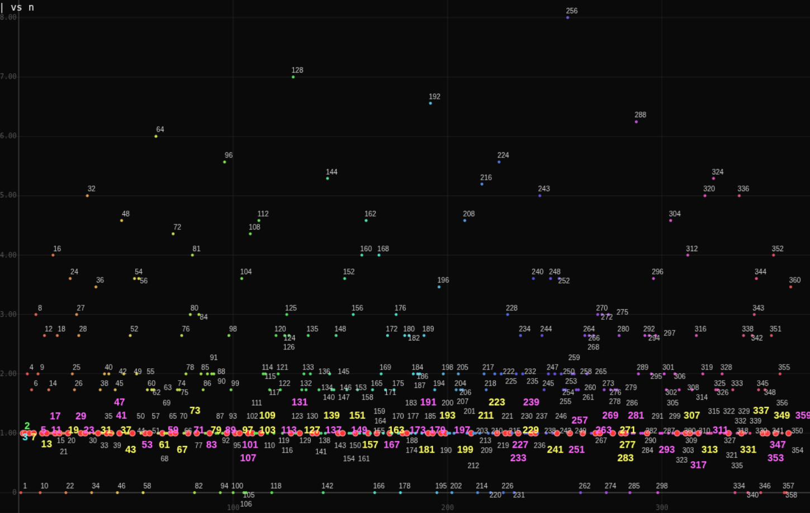](https://i.sstatic.net/IY0rdgjW.png)

#### The gem here seems to be in the real part of $s_{p}$ as $\Re{(s_{p})} = \frac{1}{2}$

[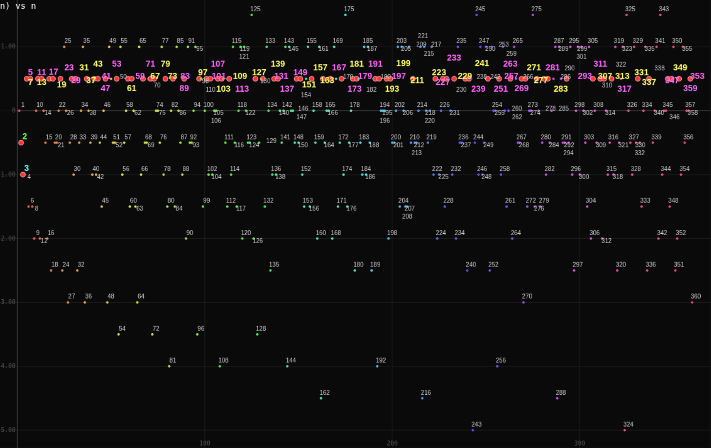](https://i.sstatic.net/0bk9suSC.png)

#### Extending the answer

My idea is to make a much more broad answer with more conclusions I gathered this month and plots of the new 3D versions of this $s_{n}$ and using lag 48 to leverage the crossing orbits, but I need some feedback regarding what I've done so far. I'd also like to know if some edit is necesary in the question. (This only addresses the question about how counting works in space) The red radius of the last question is possible I get a symbolic expression but I couldn't yet focus to find an easy way. I think It's just the radius that appears for odd $n - gons$ when you interconect all the vertex with each other?

