# Numbers live in space and time

> A notebook-essay arguing that every natural number has a *location* — a set of coordinates in the prime-factorization vector space — and a *rhythm*: how that location evolves as you walk along $n$.
>
> **Source:** `MATH_THEATER/RAW/000_numbers_live_in_space_and_time.ipynb`.

# All numbers live in a 3D+1 dimensional universe

$$\alpha_n=x_n+iy_n=|\alpha_n|e^{i\omega_{\alpha} n}$$
$$\beta_n=z_n+i\tau_n =|\beta_n|e^{i\omega_{\beta} n}$$

$$u_n=y_nz_n=|\alpha_n \beta_n| \sin{(\omega_{\alpha} n)} \cos{(\omega_{\beta}n)}$$
$$v_n=y_n \tau_n=|\alpha_n \beta_n| \sin{(\omega_{\alpha} n)}\sin{(\omega_{\beta} n)}$$
$$w_n=x_n=|\alpha_n|  \cos{(\omega_{\alpha} n)}$$

```python
from curves_in_space import *
```

$$\alpha_n=x_n+iy_n=|\alpha_n|e^{i\omega_{\alpha} n}$$

$$u_n=x_n$$
$$v_n=y_n$$
$$w_n=\log_2{|\alpha_n|}$$

```python
z=generate_Z_wave(N=100000, M=1200, Delta_r_o=1/100000, T_o=1200)

u,v,w=get_log_curves(z)
plot_curve(u, v, w, line=False, scatt=True, figsize=(16, 16), M_color=1200, 
           axis_on=True,axis_color='black', axis_text_color='white', 
           axis_line_color='white', axis_tick_color='white',cmap='hsv',show_plt=True)
```

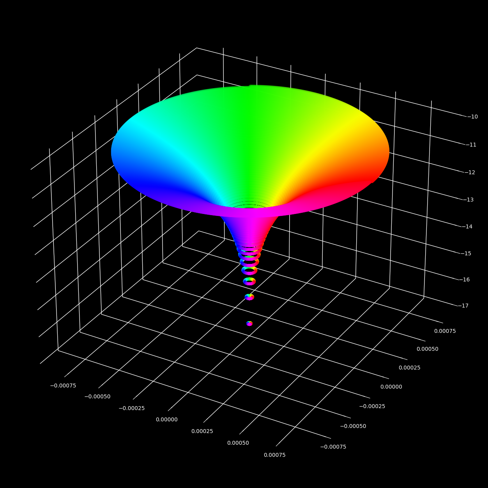

## Bloch-sphere alike points

$$Z_n=x_n+ i y_n=|Z_n|e^{\omega_z n}$$
$$u_n=\frac{2 x_n}{1+x^2_n +y^2_n}$$
$$v_n=\frac{2 y_n}{1+x^2_n +y^2_n}$$
$$w_n=\frac{1-x^2_n -y^2_n}{1+x^2_n +y^2_n}$$

```python
z=generate_Z_wave(N=130000, M=1300, Delta_r_o=1/130000, T_o=1300)
u,v,w=get_bloch_sphere(z)
plot_curve(u, v, w, line=False, scatt=True, figsize=(16, 16), M_color=1300, 
           axis_on=True,axis_color='black', axis_text_color='white', 
           axis_line_color='white', axis_tick_color='white',cmap='hsv',show_plt=True)
```

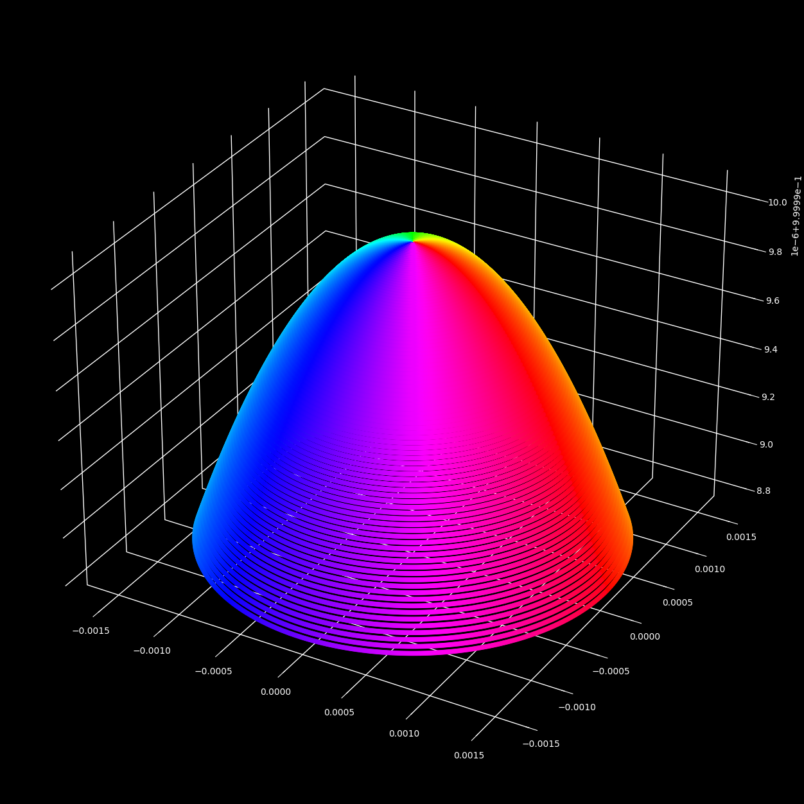

$$\beta_n=\frac{1}{\alpha_n}=\frac{1}{|\alpha_n|}e^{-i\omega_{\alpha} n}$$

$$u_n=x_n$$
$$v_n=-y_n$$
$$w_n=-\log_2{|\alpha_n|}$$

```python

u,v,w=get_log_curves(1/z)
plot_curve(u, v, w, line=False, scatt=True, figsize=(16, 16), M_color=1200, 
           axis_on=True,axis_color='black', axis_text_color='white', 
           axis_line_color='white', axis_tick_color='white',cmap='hsv',show_plt=True)
```

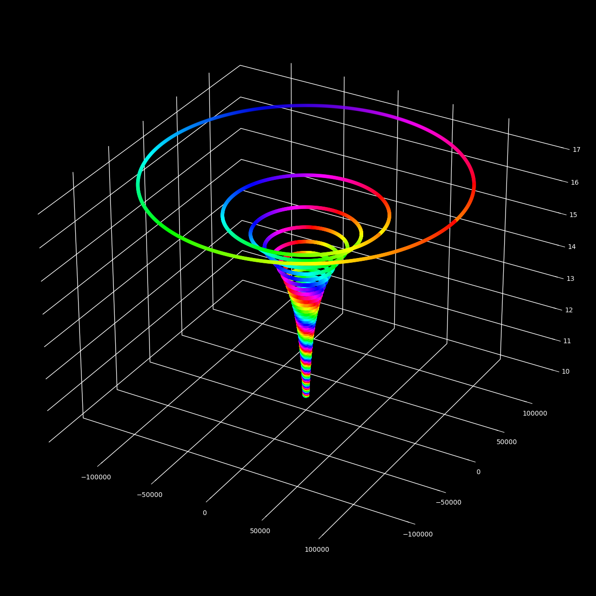

$$Z^{-1}_n=x_n + i y_n=\frac{1}{|Z_n|}e^{-\omega_z n}$$
$$u_n=\frac{2 x_n}{1+x^2_n +y^2_n}$$
$$v_n=\frac{2 y_n}{1+x^2_n +y^2_n}$$
$$w_n=\frac{1-x^2_n -y^2_n}{1+x^2_n +y^2_n}$$

```python
z=generate_Z_wave(N=100000, M=1200, Delta_r_o=1/100000, T_o=1200)
u,v,w=get_bloch_sphere(1/z)
plot_curve(u, v, w, line=False, scatt=True, figsize=(16, 16), M_color=1200, 
           axis_on=True,axis_color='black', axis_text_color='white', 
           axis_line_color='white', axis_tick_color='white',cmap='hsv',show_plt=True)
```

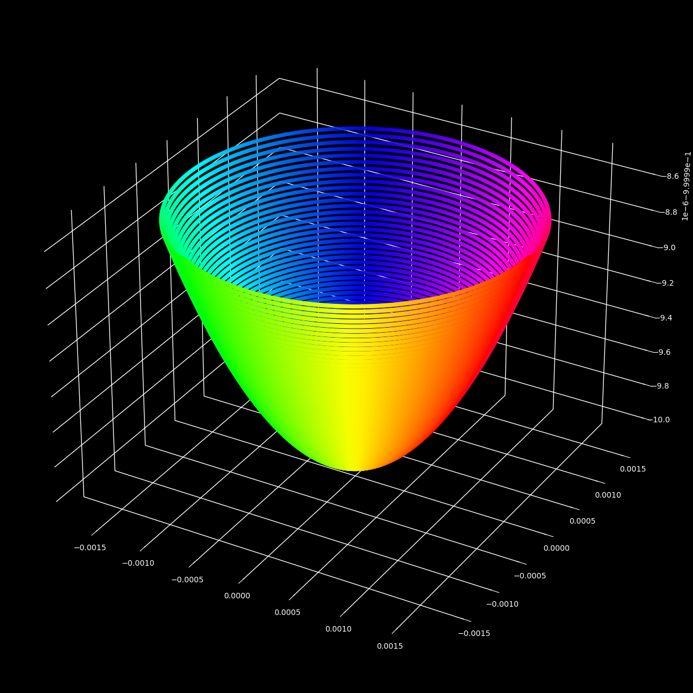

# Möbius strip as a curve inspired in the bloch-sphere

I was playing with this construction trying to understand better the bloch-sphere:

* Consider for example $|\alpha_n|$ growing according to a recursive rule of the form:

$$
|\alpha_k|=
\begin{cases}
0 &  k  < 0 \\
|\alpha_{k-1}|+\Delta |\alpha_{o}| & \space k \geq 0 \text{ and } k \equiv 0 \pmod{M} \\
|\alpha_{k-1}| & \space   k > 0 \text{ and } k \not\equiv 0 \pmod{M}
\end{cases}
$$

$$k  \in \space \mathbb{Z}$$

$$n\geq 0  \in \space \mathbb{N}$$

$$\alpha_n=x_n+iy_n=|\alpha_n|e^{i\omega_{\alpha} n}$$
$$\beta_n=z_n+i\tau_n =|\beta_n|e^{i\omega_{\beta} n}$$

$$u_n=y_nz_n=|\alpha_n \beta_n| \sin{(\omega_{\alpha} n)} \cos{(\omega_{\beta}n)}$$
$$v_n=y_n \tau_n=|\alpha_n \beta_n| \sin{(\omega_{\alpha} n)}\sin{(\omega_{\beta} n)}$$
$$w_n=x_n=|\alpha_n|  \cos{(\omega_{\alpha} n)}$$

$$C_n= n \pmod{M}$$

$$\omega_{\alpha}=\frac{2 \pi}{M}$$
And then thought of using this with this conditions:

$$\alpha_n=x_n+iy_n=|\alpha_n|e^{i\omega_{\alpha} n}$$
$$\beta_n=\frac{1}{\alpha_n} =\frac{1}{|\alpha_n|}e^{-i\omega_{\alpha} n}$$

$$u_n=y_nz_n= \sin{(\omega_{\alpha} n)} \cos{(\omega_{\alpha}n)}$$
$$v_n=y_n \tau_n= -\sin{(\omega_{\alpha} n)}\sin{(\omega_{\alpha} n)}=-\sin^2{(\omega_{\alpha} n)}$$
$$w_n=x_n=|\alpha_n|  \cos{(\omega_{\alpha} n)}$$

* Total number of samples for the plotted curve :

$$N=100 M$$

The resulting shape can be thought as an ant walking in the Möbius-strip where if you assume one set of  colors is the interior , then other set of colors can be thought as the exterior after the crossing point.

Does this set of  curves resembling a Möbius-strip have a name? Where could I read more about them and related shapes? 

## Bloch-sphere alike points using the elements of a Möbius transform in space

$$\alpha_n=x_n+ i y_n=|\alpha_n|e^{\omega_{\alpha} n}$$
$$u_n=\frac{2 x_n}{1+x^2_n +y^2_n}$$
$$v_n=\frac{2 y_n}{1+x^2_n +y^2_n}$$
$$w_n=\frac{1-x^2_n -y^2_n}{1+x^2_n +y^2_n}$$

It's interesting to note that from here is easy to imagine a "euler-quaternion" object of the form:

$$\mathbf{q_n} =
  e^{\frac{1}{2}\theta_n(u_n\mathbf{i} + v_n\mathbf{j} + w_n\mathbf{k})} =
  \cos \frac{\theta_n}{2} + (u_n\mathbf{i} + v_n\mathbf{j} + w_n\mathbf{k}) \sin \frac{\theta_n}{2}
$$

This allow us to imagine rotation and stretching actions about a general axis as multiplications, as with complex numbers in the plane:

https://en.wikipedia.org/wiki/Bloch_sphere#Rotations_about_a_general_axis

```python
M=1600
N=100*M

z=generate_Z_wave(N=N, M=M, Delta_r_o=1/N, T_o=phi)

u,v,w=get_bloch_curves(z,z**(-1))
plot_curve(u, v, w, line=False, scatt=True, figsize=(16, 16), M_color=13, 
           axis_on=True,axis_color='black', axis_text_color='white', 
           axis_line_color='white', axis_tick_color='white',cmap='hsv',show_plt=True)
```

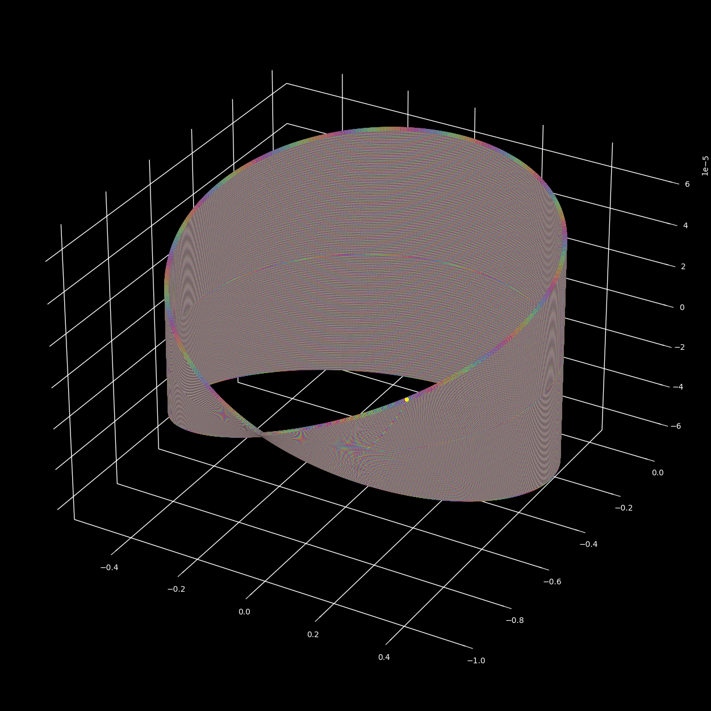

```python
M=1200
N=100*M

z=generate_Z_wave(N=N, M=M, Delta_r_o=1/N, T_o=M)
u,v,w=get_bloch_curves(-1*(1+z)/(1-z),1j*(1-z)/(1+z))
plot_curve(u, v, w, line=False, scatt=True, figsize=(16, 16), M_color=M, 
           axis_on=True,axis_color='black', axis_text_color='white', 
           axis_line_color='white', axis_tick_color='white',cmap='hsv',show_plt=True)
```

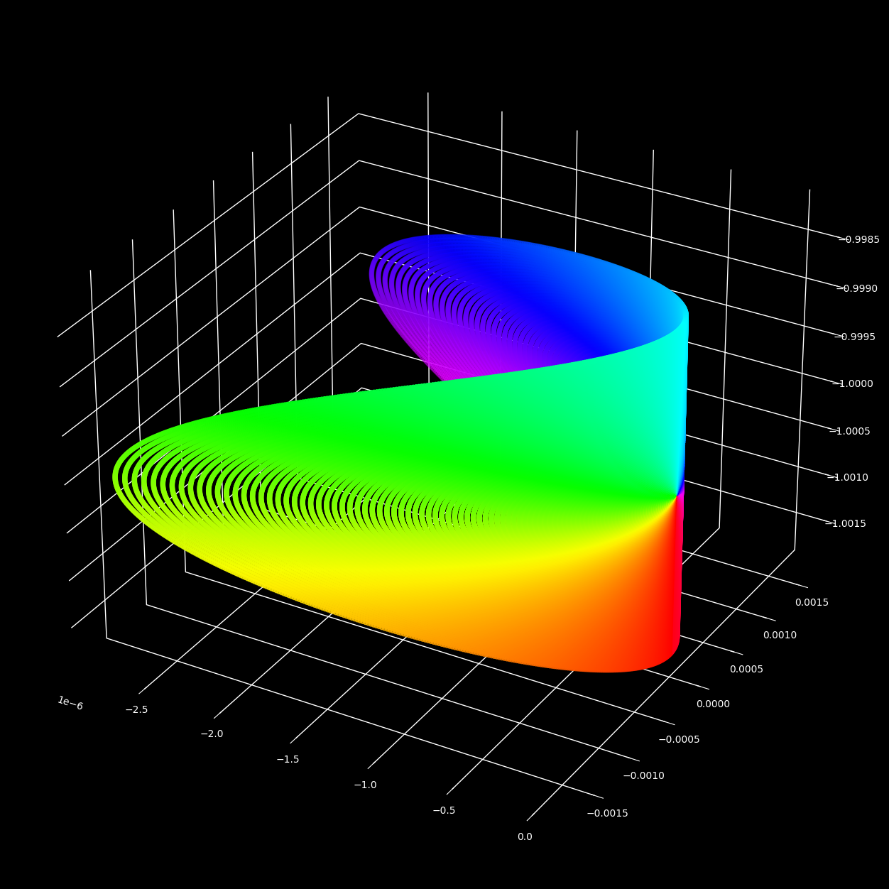

### $M_{\alpha}=M_{\beta}=1$ $M_c=13$ $T_{\alpha}=\frac{1618033988749895}{ 10^{15}} \approx \varphi$ and  $T_{\beta} \approx \varphi^{-1}$
$$n \geq 0 \in \mathbb{N}$$

$$\alpha_n=x_n+iy_n=|\alpha_n|e^{i\omega_{\alpha} n}$$

$$\beta_n=z_n+i\tau_n =|\beta_n|e^{i\omega_{\beta} n}$$

$$u_n=y_nz_n=|\alpha_n \beta_n| \sin{(\omega_{\alpha} n)} \cos{(\omega_{\beta}n)}$$

$$v_n=y_n \tau_n=|\alpha_n \beta_n| \sin{(\omega_{\alpha} n)}\sin{(\omega_{\beta} n)}$$

$$w_n=x_n=|\alpha_n|  \cos{(\omega_{\alpha} n)}$$

$$C_n= n \pmod{M_c}$$

$$\omega_{\alpha}=\frac{2 \pi}{T_{\alpha}}$$

$$\omega_{\beta}=\frac{2 \pi}{T_{\beta}}$$

$$
|\alpha_k|=
\begin{cases}
0 &  k  < 0 \\
|\alpha_{k-1}|+\Delta |\alpha_{o}| & \space k \geq 0 \text{ and } k \equiv 0 \pmod{M_{\alpha}} \\
|\alpha_{k-1}| & \space   k > 0 \text{ and } k \not\equiv 0 \pmod{M_{\alpha}}
\end{cases}
$$

$$
|\beta_k|=
\begin{cases}
0 &  k  < 0 \\
|\beta_{k-1}|+\Delta |\beta_{o}| & \space k \geq 0 \text{ and } k \equiv 0 \pmod{M_{\beta}} \\
|\beta_{k-1}| & \space   k > 0 \text{ and } k \not\equiv 0 \pmod{M_{\beta}}
\end{cases}
$$

$$N=10^{5}$$

```python
phi=0.5*(1+np.sqrt(5))
z1=generate_Z_wave(N=100000, M=1, Delta_r_o=0.001, T_o=phi)
z2=generate_Z_wave(N=100000, M=1, Delta_r_o=0.001, T_o=1/phi)

u,v,w=get_bloch_curves(z1,z2)
plot_curve(u, v, w, line=False, scatt=True, figsize=(16, 16), M_color=13, 
           axis_on=True,axis_color='black', axis_text_color='white', 
           axis_line_color='white', axis_tick_color='white',cmap='hsv',show_plt=True)
```

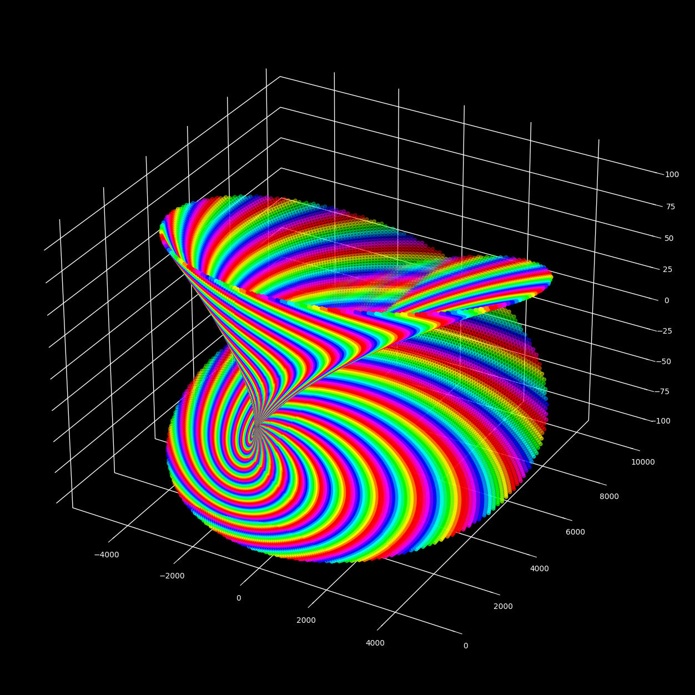

```python
sqrt2=np.sqrt(2)
z1=generate_Z_wave(N=100000, M=1, Delta_r_o=0.00001, T_o=phi)
z2=generate_Z_wave(N=100000, M=1, Delta_r_o=0.00001, T_o=1/phi) 

u,v,w=get_bloch_curves(z1,z2)
plot_curve(u, v, w, line=False, scatt=True, figsize=(16, 16), M_color=2548, 
           axis_on=True,axis_color='black', axis_text_color='white', 
           axis_line_color='white', axis_tick_color='white',cmap='hsv',show_plt=True)
```

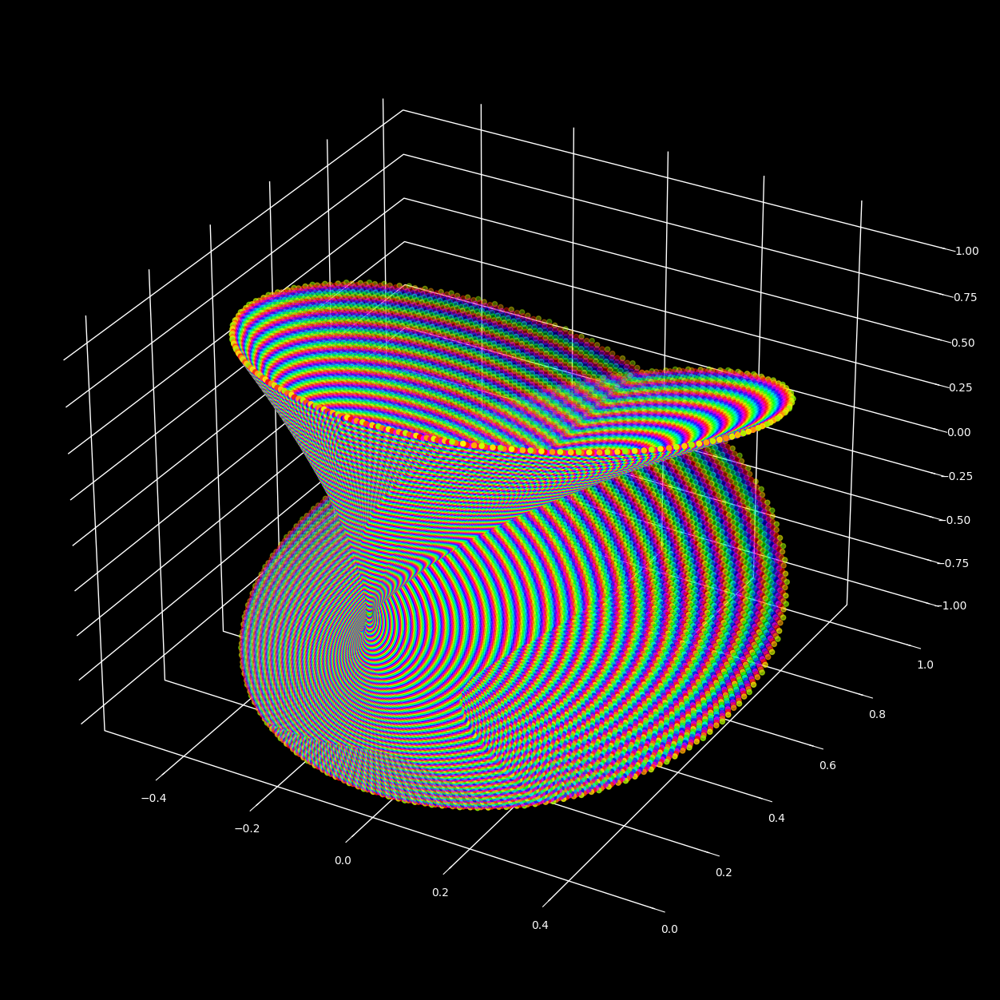

```python
sqrt2=np.sqrt(2)
z1=generate_Z_wave(N=100000, M=1, Delta_r_o=0.00001, T_o=sqrt2)
z2=generate_Z_wave(N=100000, M=1, Delta_r_o=0.00001, T_o=1/sqrt2) 

u,v,w=get_bloch_curves(z1,z2)
plot_curve(u, v, w, line=False, scatt=True, figsize=(16, 16), M_color=2548, 
           axis_on=True,axis_color='black', axis_text_color='white', 
           axis_line_color='white', axis_tick_color='white',cmap='hsv',show_plt=True)
```

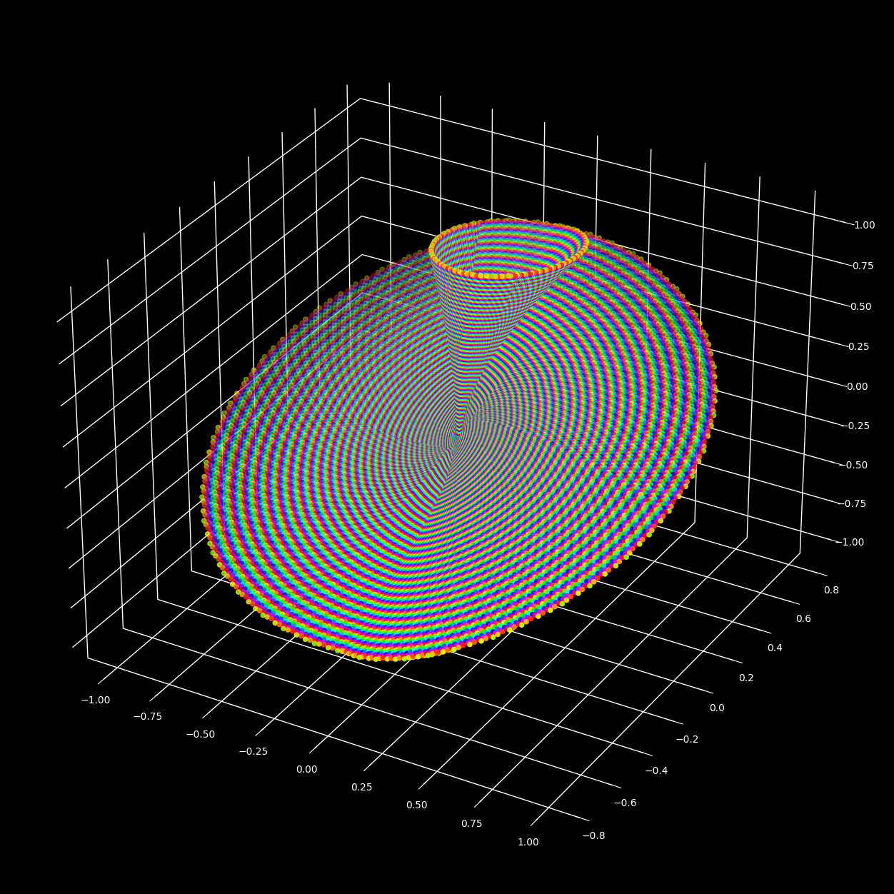

```python
T_o_1=1/1301
T_o_2=-1301/1
M_color=1300
N=10**5
M=1300
Delta_r_o=1/N

z1=generate_Z_wave(N, M, Delta_r_o, T_o_1)
z2=generate_Z_wave(N, M, Delta_r_o, T_o_2)

u,v,w=get_bloch_curves(z1,z2)
plot_curve(u, v, w, line=False, scatt=True, figsize=(16, 16), M_color=M_color, 
           axis_on=True,axis_color='black', axis_text_color='white', 
           axis_line_color='white', axis_tick_color='white',cmap='hsv',show_plt=True)
```

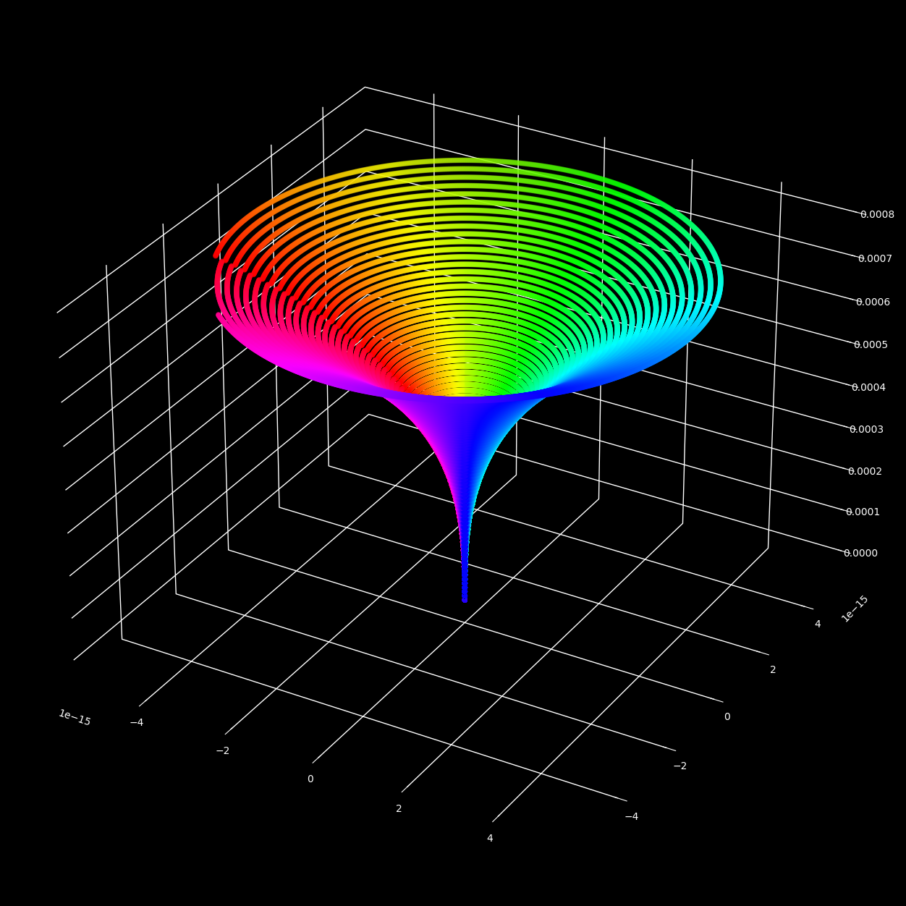

```python
T_o_1=1/phi
T_o_2=phi
M_color=13
N=10**6
M=13
Delta_r_o=1/np.sqrt(N)

z1=generate_Z_wave(N, M, Delta_r_o, T_o_1)
z2=generate_Z_wave(N, M, Delta_r_o, T_o_2)

u,v,w=get_bloch_curves(z1,z2)
plot_curve(u, v, w, line=False, scatt=True, figsize=(16, 16), M_color=M_color, 
           axis_on=True,axis_color='black', axis_text_color='white', 
           axis_line_color='white', axis_tick_color='white',cmap='hsv',show_plt=True)
```

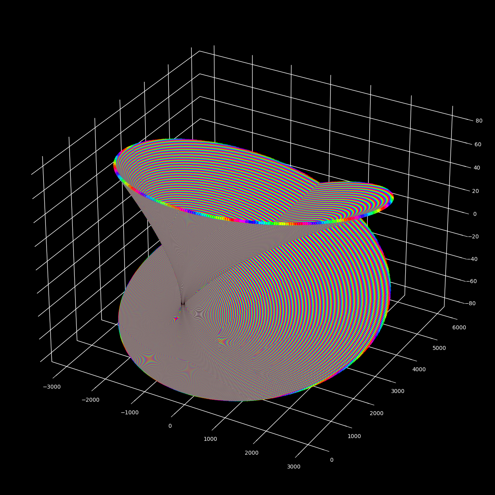
