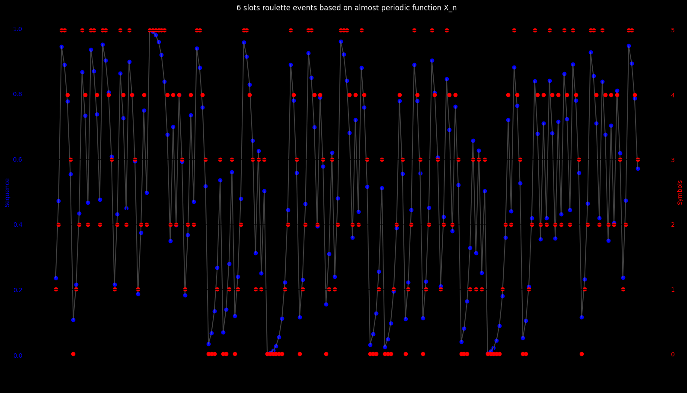
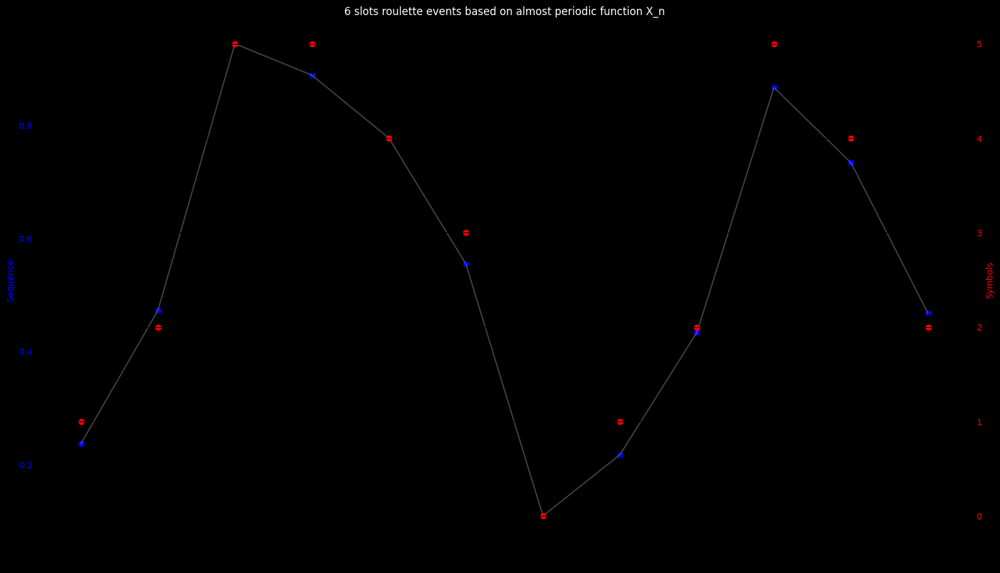
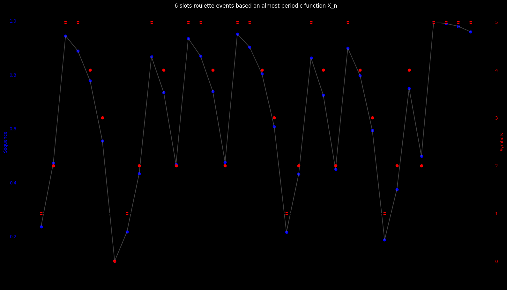
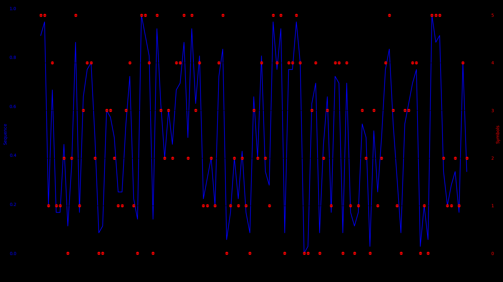
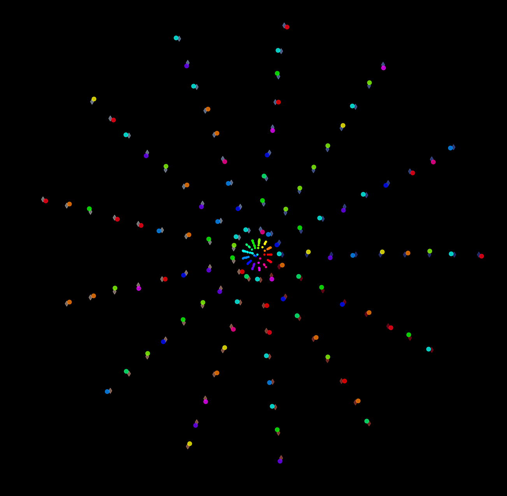
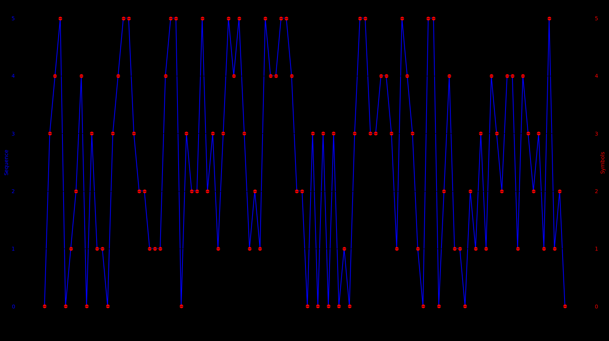

# Roulette experiments — probability as counting

> A side-experiment using a roulette wheel to make probability visceral — counting frequencies, comparing empirical to theoretical, and relating it back to the symmetry arguments used in the Numbers and Energy essay.
>
> **Source:** `MATH_THEATER/RAW/0000_ROULETTE_EXPERIMENTS_README.ipynb`.

## Experiment to discover if there is some group theory hidden in the Roulette game ordering of the symbols and arrangement of the betting board. 

We all know that given the payout, in the long term we expect to lose 2.7% of the initial bankroll in the European roulette with 37 slots. The idea of this experiment is not to beat roulette, but to explain an example of a circular representation of sequences in the complex plane, where we create representations where growing radius M-gons (in this case M=37) have their vertex labeled by a finite set of associated symbols that are are ordered  and represented in space event by event according to a finite set of rules. 

Q0: I'm interested on references to roulette game mathematical easter eggs if any. I'd be happy to know fun facts about the math of the game, it's history and  about it's creators, their mathematical inspiration if any, all information  that might not come up on a simple google search. 

Q1: Im interested on a take or reading recommendation about statistics and probability from a professional able to introduce a student to relevant statistic techniques following a specific thought experiment I will introduce. Is there some  useful statistic techniques that use complex number representations of the data or that perform statistics based on circular representations?  

I've done previous research on this, and found many papers on a mathematical treatment of "newtonian-roulette". I'm more interested in recommendations of books that introduce relevant statistics methods by exploring mathematically games of chance like roulette. 

Q2:I've been introducing myself to the universe of Markov chains, I'm interested on reading recommendations of MC analysis of the game of roulette. 
This is a good introduction I was happily able to follow and basically understand. 
https://math.stackexchange.com/questions/472879/markov-chain-monte-carlo-in-plain-english/472922#472922

### European roulette experiment description 

We will assume for this  experiment, that it is known as a fact that in a given  set of laboratory roulette wheels (rw)(with different manufacturing and ages of use and different manipulations made on them) and a set of roulette wheel operators (rwo) operating different (rw) during alternating periods, biassed results are produced   on the outcomes of the winning slots (thought as certain set of numbers ordered in the wheel from and index $L_n=S_n=0$  ) during short term bursts of max size $f(M_c)$ samples. 

The task is to assume you don't know how the events will evolve, and by trial and error discover in the shortest time possible $M_c$ values for a given dataset produced by this (rw)+(rwo) and asses about possible winning strategies that could exploit these biasses in similar scenarios.  We will be looking for predictable patterns observable by correlation in the sectors of the physical wheel that are more frequent during a certain period, but also find some structure given the accumulated history of spins in how often and how far jumps from last spin result we know to the next we don't know yet. We also perform some higher order backward differences and store them sequentially event by event during the experiment. 

 We distinguish between the bias that can be produced by the (rw) physics , as some mechanical anomaly that in combination of the periodic stimuli characteristics  of some (rwo)  produce biased results in the outcomes thought as sectors of the physical wheel that are the best prediction for the given amount of information about the previous spins at a certain spin $n$ given the assumption that a predictable pattern is detectable in less than $M/2$ consecutive samples for the same (rw) and (rwo). We can think of a process that shows the data and organizes the events producing a representation that allows to easily see correlation. This is the reason that the experiment starts and ends with the same rw and rwo and and we care mostly about the last-2-spins-results because it is assumed that some rwo because of being human may periodically use the same force to spin the wheel from some starting position related to the result of the last-spin and sometimes this behavior is only observable between 3,4,5,6, or 7 or more accumulated events. 

We are asked to asses a combination of parameters for a betting strategy that after calculating a basic set of statistics to discover the assumed bias, is able to exploit it in less than $M/2$ steps, in this case giving us 18 spins in total to measure some statistics and decide a strategy assuming the original statement about the bias being present in the wheels is true. I'm curious to know if professional statisticians already made this experiments and this might have indicated that it was important to do maintenance to the wheels, do periodic statistical analysis and also recommend to the (rwo) to follow certain procedure that guarantees their stimuli to the (rw) spin after spin changes it's properties. 

We have a history of the outcomes produced by the combination of different (rw) and (rwo), N samples for each cataloged by different initial conditions. 

## Variables

The discrete-time index is $n \geq 0 \in \mathbb{N}$

For a simple example we can consider an European roulette wheel, where we can use a 37-gon represented in the complex plane that represents the roulette, and a set of labels that associate each vertex of the M-gon with $M=37$ to different representations of the events 

$$n=\{0, 1, 2, 3, 4,.....,N-1\}$$

$$S=\{0, 1, 2, 3, 4,.....,M-1 \}$$

$$M\leq N$$

The ordered index of the positions in the wheel for this example is

$$S=\{0, 1, 2, 3, 4, 5, 6, 7, 8, 9, 10, 11, 12, 13, 14, 15, 16, 17, 18, 19, 20, 21, 22, 23, 24, 25, 26, 27, 28, 29, 30, 31, 32, 33, 34, 35, 36\}$$

### Mapping the ordered positions symbol  $S_n$ to it's label $L_n$ it's color $C_n$

This array maps the position in the wheel counting counterclockwise  in the complex plane , to the label present in that position in the wheel. 

$$L_n=\ell(S_n)=\{0, 26, 3, 35, 12, 28, 7, 29, 18, 22, 9, 31, 14, 20, 1, 33, 16, 24, 5, 10, 23, 8, 30, 11, 36, 13, 27, 6, 34, 17, 25, 2, 21, 4, 19, 15, 32\}$$

* Note that the 0th element and the 16th elements are the only ones that have the same symbol for Label $L$ and position $S$ meaning $\ell(0)=0$ and $\ell(16)=16$ 

* To place bet's you have a limited time (as acumulated set of events from a starting point) to decide to bet or not to bet and if you decide to bet you have to have a clear progression in your betting system that tries to win with little risk in the first steps, a maximum amount of bet steps in a row that you should bet, and a progression formula to guarantee a minimum payout  for a certain tolerance  to risk.

### Mapping the label $L_n$ to it's correspondent ordered symbol $S_n$
This arrays maps the label of an outcome to the position in the wheel. For example if the label is 1, we see that $S(1)=14$ , so that label $1$ corresponds to position $14$ in the ordered wheel. Consider that this is what we receive from the (rwo) as the winning number for each $n$, and is the numbers we use for betting. But our strategy will be focused on areas of symbols in the physical wheel. 

$$S_n=s(L_n)=\{0, 14, 31, 2, 33, 18, 27, 6, 21, 10, 19, 23, 4, 25, 12, 35, 16, 29, 8, 34, 13, 32, 9, 20, 17, 30, 1, 26, 5, 7, 22, 11, 36, 15, 28, 3, 24\}$$

## Complex numbers representation 

So the mapping of the roulette wheel in the complex plane has two main possible representations. 

* A circular histogram representing the total number of times events    $x_n$ happen during a certain number of spins.

$$\hat{H}_n=Klog_b(n)e^{\frac{2 \pi i}{M}S_n}$$

* A discrete-time orbit that shows the event representation as an associated symbol to a vertex of a set polygons in the plane, for example for $r_n$ $\omega ^n$ $ \in \mathbb{C}$: 

$$\hat{n}_n=r_n\omega ^n $$

$$\hat{S}_n=K\space e^{\frac{2 \pi i}{M}S_n}$$

$$Z_n=\hat{n}_n + \hat{S}_n$$

## Associating a color to each vertex of $\hat{n}_n$ and to each $\hat{S}_n$

In general we will have a finite set that we can represent by a colormap, used to associate each vertex of complex variable path to a color given a certain rule in the index of the complex variable rotation. 

$$C_n=f[n]$$

$$C_{S_n}=g[S_n]$$

This color $C_{S_n} \pmod{M}$ could be for example a representation of temperature   during certain periods of time $C_n=f[n] \pmod{M_c}$, or a maybe a symbol in a given string of transmitted or stored finite collection of symbols in a computer, etc. The idea is to find a structure that syncs perfectly with the given $f[n]$ associated to the color providing visual hints about what parameters allow to detect correlation. 

## Input mapping $S_n$ using $M=6$ from an almost-periodic or quasi-periodic source

$$X_{n+1}\equiv(K+1) X_{n} \pmod{K}$$ 

$$ X_{0}=\frac{p_o}{q_o} \in \mathbb{Q}  \space [0,1]$$

For this example we will use:

$$X_{n+1}\equiv 2 X_{n} \pmod{1}$$ 

   - If $0 \leq X_n < \frac{1}{6}$, then $$X_n \rightarrow 0$$
   - If $\frac{1}{6} \leq X_n < \frac{2}{6}$, then $$X_n \rightarrow 1$$
   - If $\frac{2}{6} \leq X_n < \frac{3}{6}$, then $$X_n \rightarrow 2$$
   - If $\frac{3}{6} \leq X_n < \frac{4}{6}$, then $$X_n \rightarrow 3$$
   - If $\frac{4}{6} \leq X_n < \frac{5}{6}$, then $$X_n \rightarrow 4$$
   - If $\frac{5}{6} \leq X_n < 1$, then $$X_n \rightarrow 5$$

- Sequence: 

$$X_n : \{0.6180339887498949, 0.23606797749985153, 0.47213595499972666, 0.9442719099995005, 0.8885438199990954, 0.7770876399982796, 0.5541752799966368, 0.10835055999332899, 0.2167011199866688, 0.43340223997335925, 0.8668044799467618, 0.7336089598936102, 0.46721791978729366\}$$

$$S_n:  \{3, 1, 2, 5, 5, 4, 3, 0, 1, 2, 5, 4, 2\}$$

$$\Delta S_n:  \{-2, 1, 3, 0, -1, -1, -3, 1, 1, 3, -1, -2\}$$

#### Trick found to significantly extend the numbers of iterations where a "almost-periodicity" is sustained.
I can't exactly explain why this works but:
Adding a $\delta=\alpha \space 10^{-15}$ works as a hack and maintains the "almost-periodicity" for a much larger number of iterations:

$$X_{n+1}\equiv (2+\delta) X_{n} \pmod{1}$$

```python
from data_modulation import *
# Parameters
delta = 0.0000000000001  # Example delta value
X0 = 0.5*(1+np.sqrt(5)) -1    # Example initial value
n = 13       # Length of the sequence
# Generate the sequence
sequence = generate_sequence(delta, X0, n)

# Map the sequence to symbols
symbols = map_to_symbols(sequence)

# Compute backward differences
first_diff, second_diff, third_diff = backward_differences(symbols)

# Print the results
print("Sequence:", sequence)
print("Symbols: ", symbols)
print("First backward differences: ", first_diff)
# print("Second backward differences:", second_diff)
# print("Third backward differences: ", third_diff)

# Plot the sequence and symbols
plot_sequence_and_symbols(sequence, symbols)
```

```
Sequence: [0.6180339887498949, 0.23606797749985153, 0.47213595499972666, 0.9442719099995005, 0.8885438199990954, 0.7770876399982796, 0.5541752799966368, 0.10835055999332899, 0.2167011199866688, 0.43340223997335925, 0.8668044799467618, 0.7336089598936102, 0.46721791978729366, 0.9344358395746339, 0.8688716791493611, 0.7377433582988091, 0.4754867165976919, 0.9509734331954314, 0.9019468663909578, 0.8038937327820057, 0.6077874655640918, 0.21557493112824444, 0.4311498622565104, 0.8622997245130639, 0.724599449026214, 0.44919889805250035, 0.8983977961050456, 0.7967955922101808, 0.5935911844204413, 0.18718236884094197, 0.37436473768190265, 0.7487294753638427, 0.49745895072776025, 0.9949179014555702, 0.98983580291124, 0.9796716058225787, 0.9593432116452554, 0.9186864232906067, 0.8373728465813051, 0.6747456931626938, 0.3494913863254552, 0.6989827726509453, 0.3979655453019606, 0.795931090603961, 0.5918621812080014, 0.18372436241606183, 0.367448724832142, 0.7348974496643208, 0.4697948993287151, 0.9395897986574772, 0.8791795973150482, 0.7583591946301844, 0.5167183892604446, 0.033436778520940846, 0.06687355704188504, 0.13374711408377676, 0.2674942281675669, 0.5349884563351606, 0.06997691267037465, 0.1399538253407563, 0.27990765068152657, 0.5598153013630811, 0.11963060272621817, 0.2392612054524483, 0.47852241090492054, 0.9570448218098889, 0.9140896436198735, 0.8281792872398384, 0.6563585744797595, 0.3127171489595846, 0.6254342979192004, 0.2508685958384631, 0.5017371916769513, 0.0034743833539527813, 0.0069487667079059096, 0.013897533415812513, 0.027795066831626414, 0.0555901336632556, 0.11118026732651676, 0.22236053465304462, 0.44472106930611144, 0.8894421386122673, 0.7788842772246234, 0.5577685544493245, 0.11553710889870472, 0.231074217797421, 0.46214843559486507, 0.9242968711897763, 0.848593742379645, 0.6971874847593749, 0.39437496951881945, 0.7887499390376783, 0.5774998780754355, 0.15499975615092865, 0.3099995123018728, 0.6199990246037765, 0.23999804920761503, 0.47999609841525404, 0.959992196830556, 0.919984393661208, 0.8399687873225079, 0.6799375746450997, 0.3598751492902674, 0.7197502985805708, 0.4395005971612136, 0.8790011943224711, 0.7580023886450302, 0.5160047772901362, 0.03200955458032384, 0.06401910916065087, 0.12803821832130813, 0.256076436642629, 0.5121528732852836, 0.024305746570618236, 0.0486114931412389, 0.09722298628248266, 0.19444597256497503, 0.3888919451299695, 0.7777838902599779, 0.5555677805200334, 0.11113556104012234, 0.2222711220802558, 0.4445422441605338, 0.889084488321112, 0.7781689766423128, 0.5563379532847033, 0.11267590656946203, 0.22535181313893532, 0.4507036262778932, 0.9014072525558314, 0.802814505111753, 0.6056290102235862, 0.21125802044723296, 0.422516040894487, 0.8450320817890162, 0.6900641635781168, 0.38012832715630274, 0.7602566543126434, 0.5205133086253628, 0.04102661725077761, 0.08205323450155931, 0.1641064690031268, 0.32821293800627, 0.6564258760125727, 0.312851752025211, 0.6257035040504533, 0.25140700810096916, 0.5028140162019634, 0.0056280324039770235, 0.011256064807954609, 0.022512129615910342, 0.04502425923182293, 0.09004851846365036, 0.18009703692730972, 0.3601940738546374, 0.7203881477093108, 0.44077629541869356, 0.8815525908374312, 0.7631051816749506, 0.5262103633499773, 0.05242072670000719, 0.10484145340001962, 0.2096829068000497, 0.4193658136001203, 0.8387316272002825, 0.6774632544006487, 0.3549265088013651, 0.7098530176027656, 0.4197060352056021, 0.8394120704112462, 0.6788241408225764, 0.35764828164522044, 0.7152965632904766, 0.4305931265810248, 0.8611862531620926, 0.7223725063242714, 0.444745012648615, 0.8894900252972744, 0.7789800505946376, 0.5579601011893531, 0.115920202378762, 0.23184040475753556, 0.46368080951509427, 0.9273616190302348, 0.8547232380605623, 0.70944647612121, 0.4188929522424909, 0.8377859044850237, 0.675571808970131, 0.35114361794032956, 0.7022872358806942, 0.40457447176145855, 0.8091489435229575, 0.6182978870459959, 0.23659577409205346, 0.47319154818413056, 0.9463830963683084, 0.8927661927367114, 0.7855323854735121, 0.5710647709471026]
Symbols:  [3, 1, 2, 5, 5, 4, 3, 0, 1, 2, 5, 4, 2, 5, 5, 4, 2, 5, 5, 4, 3, 1, 2, 5, 4, 2, 5, 4, 3, 1, 2, 4, 2, 5, 5, 5, 5, 5, 5, 4, 2, 4, 2, 4, 3, 1, 2, 4, 2, 5, 5, 4, 3, 0, 0, 0, 1, 3, 0, 0, 1, 3, 0, 1, 2, 5, 5, 4, 3, 1, 3, 1, 3, 0, 0, 0, 0, 0, 0, 1, 2, 5, 4, 3, 0, 1, 2, 5, 5, 4, 2, 4, 3, 0, 1, 3, 1, 2, 5, 5, 5, 4, 2, 4, 2, 5, 4, 3, 0, 0, 0, 1, 3, 0, 0, 0, 1, 2, 4, 3, 0, 1, 2, 5, 4, 3, 0, 1, 2, 5, 4, 3, 1, 2, 5, 4, 2, 4, 3, 0, 0, 0, 1, 3, 1, 3, 1, 3, 0, 0, 0, 0, 0, 1, 2, 4, 2, 5, 4, 3, 0, 0, 1, 2, 5, 4, 2, 4, 2, 5, 4, 2, 4, 2, 5, 4, 2, 5, 4, 3, 0, 1, 2, 5, 5, 4, 2, 5, 4, 2, 4, 2, 4, 3, 1, 2, 5, 5, 4, 3]
First backward differences:  [-2, 1, 3, 0, -1, -1, -3, 1, 1, 3, -1, -2, 3, 0, -1, -2, 3, 0, -1, -1, -2, 1, 3, -1, -2, 3, -1, -1, -2, 1, 2, -2, 3, 0, 0, 0, 0, 0, -1, -2, 2, -2, 2, -1, -2, 1, 2, -2, 3, 0, -1, -1, -3, 0, 0, 1, 2, -3, 0, 1, 2, -3, 1, 1, 3, 0, -1, -1, -2, 2, -2, 2, -3, 0, 0, 0, 0, 0, 1, 1, 3, -1, -1, -3, 1, 1, 3, 0, -1, -2, 2, -1, -3, 1, 2, -2, 1, 3, 0, 0, -1, -2, 2, -2, 3, -1, -1, -3, 0, 0, 1, 2, -3, 0, 0, 1, 1, 2, -1, -3, 1, 1, 3, -1, -1, -3, 1, 1, 3, -1, -1, -2, 1, 3, -1, -2, 2, -1, -3, 0, 0, 1, 2, -2, 2, -2, 2, -3, 0, 0, 0, 0, 1, 1, 2, -2, 3, -1, -1, -3, 0, 1, 1, 3, -1, -2, 2, -2, 3, -1, -2, 2, -2, 3, -1, -2, 3, -1, -1, -3, 1, 1, 3, 0, -1, -2, 3, -1, -2, 2, -2, 2, -1, -2, 1, 3, 0, -1, -1]
Second backward differences: [3, 2, -3, -1, 0, -2, 4, 0, 2, -4, -1, 5, -3, -1, -1, 5, -3, -1, 0, -1, 3, 2, -4, -1, 5, -4, 0, -1, 3, 1, -4, 5, -3, 0, 0, 0, 0, -1, -1, 4, -4, 4, -3, -1, 3, 1, -4, 5, -3, -1, 0, -2, 3, 0, 1, 1, -5, 3, 1, 1, -5, 4, 0, 2, -3, -1, 0, -1, 4, -4, 4, -5, 3, 0, 0, 0, 0, 1, 0, 2, -4, 0, -2, 4, 0, 2, -3, -1, -1, 4, -3, -2, 4, 1, -4, 3, 2, -3, 0, -1, -1, 4, -4, 5, -4, 0, -2, 3, 0, 1, 1, -5, 3, 0, 1, 0, 1, -3, -2, 4, 0, 2, -4, 0, -2, 4, 0, 2, -4, 0, -1, 3, 2, -4, -1, 4, -3, -2, 3, 0, 1, 1, -4, 4, -4, 4, -5, 3, 0, 0, 0, 1, 0, 1, -4, 5, -4, 0, -2, 3, 1, 0, 2, -4, -1, 4, -4, 5, -4, -1, 4, -4, 5, -4, -1, 5, -4, 0, -2, 4, 0, 2, -3, -1, -1, 5, -4, -1, 4, -4, 4, -3, -1, 3, 2, -3, -1, 0]
Third backward differences:  [-1, -5, 2, 1, -2, 6, -4, 2, -6, 3, 6, -8, 2, 0, 6, -8, 2, 1, -1, 4, -1, -6, 3, 6, -9, 4, -1, 4, -2, -5, 9, -8, 3, 0, 0, 0, -1, 0, 5, -8, 8, -7, 2, 4, -2, -5, 9, -8, 2, 1, -2, 5, -3, 1, 0, -6, 8, -2, 0, -6, 9, -4, 2, -5, 2, 1, -1, 5, -8, 8, -9, 8, -3, 0, 0, 0, 1, -1, 2, -6, 4, -2, 6, -4, 2, -5, 2, 0, 5, -7, 1, 6, -3, -5, 7, -1, -5, 3, -1, 0, 5, -8, 9, -9, 4, -2, 5, -3, 1, 0, -6, 8, -3, 1, -1, 1, -4, 1, 6, -4, 2, -6, 4, -2, 6, -4, 2, -6, 4, -1, 4, -1, -6, 3, 5, -7, 1, 5, -3, 1, 0, -5, 8, -8, 8, -9, 8, -3, 0, 0, 1, -1, 1, -5, 9, -9, 4, -2, 5, -2, -1, 2, -6, 3, 5, -8, 9, -9, 3, 5, -8, 9, -9, 3, 6, -9, 4, -2, 6, -4, 2, -5, 2, 0, 6, -9, 3, 5, -8, 8, -7, 2, 4, -1, -5, 2, 1]
```



```
Sequence: [0.6180339887498949, 0.23606797749985153, 0.47213595499972666, 0.9442719099995005, 0.8885438199990954, 0.7770876399982796, 0.5541752799966368, 0.10835055999332899, 0.2167011199866688, 0.43340223997335925, 0.8668044799467618, 0.7336089598936102, 0.46721791978729366]
Symbols:  [3, 1, 2, 5, 5, 4, 3, 0, 1, 2, 5, 4, 2]
First backward differences:  [-2, 1, 3, 0, -1, -1, -3, 1, 1, 3, -1, -2]
```



```python
import numpy as np
from data_modulation import *

# Parameters
delta = 0.0000000000001  # Example delta value
X0 = 0.5*(1+np.sqrt(5)) -1  # Example initial value
n = 37 # Length of the sequence
batch_size = 11111 # Example batch size

# Generate the sequence
sequence = generate_sequence(delta, X0, n)

# Map the sequence to symbols
symbols = map_to_symbols(sequence)

# Function to find the maximum length of consecutive differences with absolute value > 1
def max_consecutive_greater_than_one(differences, batch_size):
    max_count = 0
    current_count = 0
    
    for i in range(0, len(differences), batch_size):
        batch = differences[i:i + batch_size]
        
        for diff in batch:
            if abs(diff) > 1:
                current_count += 1
                max_count = max(max_count, current_count)
            else:
                current_count = 0
        
        # Reset current_count for the next batch
        current_count = 0
        
    return max_count

# Compute backward differences
first_diff, second_diff, third_diff = backward_differences(symbols)

# Find the maximum length of consecutive differences > 1 for each backward difference
first_diff_max = max_consecutive_greater_than_one(first_diff, batch_size)
second_diff_max = max_consecutive_greater_than_one(second_diff, batch_size)
third_diff_max = max_consecutive_greater_than_one(third_diff, batch_size)

# Print the results
print("Sequence:", sequence)
print("Symbols: ", symbols)
print("First backward differences: ", first_diff)
print("Max consecutive absolute backward differences > 1 (first difference):", first_diff_max)
print("Max consecutive absolute backward differences > 1 (second difference):", second_diff_max)
print("Max consecutive absolute backward differences > 1 (third difference):", third_diff_max)

# Plot the sequence and symbols
plot_sequence_and_symbols(sequence, symbols)
```

```
Sequence: [0.6180339887498949, 0.23606797749985153, 0.47213595499972666, 0.9442719099995005, 0.8885438199990954, 0.7770876399982796, 0.5541752799966368, 0.10835055999332899, 0.2167011199866688, 0.43340223997335925, 0.8668044799467618, 0.7336089598936102, 0.46721791978729366, 0.9344358395746339, 0.8688716791493611, 0.7377433582988091, 0.4754867165976919, 0.9509734331954314, 0.9019468663909578, 0.8038937327820057, 0.6077874655640918, 0.21557493112824444, 0.4311498622565104, 0.8622997245130639, 0.724599449026214, 0.44919889805250035, 0.8983977961050456, 0.7967955922101808, 0.5935911844204413, 0.18718236884094197, 0.37436473768190265, 0.7487294753638427, 0.49745895072776025, 0.9949179014555702, 0.98983580291124, 0.9796716058225787, 0.9593432116452554]
Symbols:  [3, 1, 2, 5, 5, 4, 3, 0, 1, 2, 5, 4, 2, 5, 5, 4, 2, 5, 5, 4, 3, 1, 2, 5, 4, 2, 5, 4, 3, 1, 2, 4, 2, 5, 5, 5, 5]
First backward differences:  [-2, 1, 3, 0, -1, -1, -3, 1, 1, 3, -1, -2, 3, 0, -1, -2, 3, 0, -1, -1, -2, 1, 3, -1, -2, 3, -1, -1, -2, 1, 2, -2, 3, 0, 0, 0]
Max consecutive absolute backward differences > 1 (first difference): 3
Max consecutive absolute backward differences > 1 (second difference): 3
Max consecutive absolute backward differences > 1 (third difference): 9
```



## Real roulette data

```python
from roulette_simulation import *

# Usage
batch = initialize_wheels(batch_size=111,N=6,M=37)
batch_n_hat, batch_L_hat, batch_S_hat, batch_n = create_numpy_arrays(batch)
S = np.array(batch['S'].values)
L=np.array(batch['L'].values)
# S_symbols = map_to_symbols(S / 37, M=6)
# S_symbols = S_symbols.reshape(1, -1)
# S_symbols=S_symbols[0][0:S.size]
S_symbols=map_to_symbols(S,M=6)
M_c=S.size
# S_6=convert_symbol_to_mod_6_x(S)
print("Label events from real roulette data: ", L[0:M_c*2])
print("Ordered wheel symbol  37 slots: ",S[0:M_c*2])
print(" Equivalent Ordered wheel symbol  6 slots: ",S_symbols[0:M_c*2])

plot_sequence_and_symbols(S[0:M_c] / 36, S_symbols[:M_c])
```

```
Label events from real roulette data:  [21 19 29 36  7  7 16 12 20  2  7 11  6 34 24 35 12  8 23 24 22 22 10 27
 18 28 15 21 17 28  4 30  1  8 16 36 13  2 24  4 30 17 18 31  1 29 27 25
  3  7  1 18 33  7 35 11  1 17 14  9 19  6  4 35  6  6 19 34  0 26 30 13
 35 16 11  7 27 13 35 13  7 12  7 10 24 26  5 22 24  6 25 10 31 35 10 30
 13  6 26 29  3 15  2 21 14 29  9 14  7 34 14]
Ordered wheel symbol  37 slots:  [32 34  7 24  6  6 16  4 13 31  6 23 27 28 17  3  4 21 20 17  9  9 19 26
  8  5 35 32 29  5 33 22 14 21 16 24 25 31 17 33 22 29  8 11 14  7 26 30
  2  6 14  8 15  6  3 23 14 29 12 10 34 27 33  3 27 27 34 28  0  1 22 25
  3 16 23  6 26 25  3 25  6  4  6 19 17  1 18  9 17 27 30 19 11  3 19 22
 25 27  1  7  2 35 31 32 12  7 10 12  6 28 12]
 Equivalent Ordered wheel symbol  6 slots:  [5 5 1 4 1 1 2 0 2 5 1 3 4 4 2 0 0 3 3 2 1 1 3 4 1 0 5 5 4 0 5 3 2 3 2 4 4
 5 2 5 3 4 1 1 2 1 4 5 0 1 2 1 2 1 0 3 2 4 2 1 5 4 5 0 4 4 5 4 0 0 3 4 0 2
 3 1 4 4 0 4 1 0 1 3 2 0 3 1 2 4 5 3 1 0 3 3 4 4 0 1 0 5 5 5 2 1 1 2 1 4 2]
```



# 6 symbols mapping of roulette events

| $S_n$| s_n |
|--------------|---------------|
| 0            | 0             |
| 1            | 0             |
| 2            | 0             |
| 3            | 0             |
| 4            | 1             |
| 5            | 1             |
| 6            | 1             |
| 7            | 1             |
| 8            | 1             |
| 9            | 1             |
| 10           | 2             |
| 11           | 2             |
| 12           | 2             |
| 13           | 2             |
| 14           | 2             |
| 15           | 2             |
| 16           | 3             |
| 17           | 3             |
| 18           | 3             |
| 19           | 3             |
| 20           | 3             |
| 21           | 3             |
| 22           | 4             |
| 23           | 4             |
| 24           | 4             |
| 25           | 4             |
| 26           | 4             |
| 27           | 4             |
| 28           | 5             |
| 29           | 5             |
| 30           | 5             |
| 31           | 5             |
| 32           | 5             |
| 33           | 5             |
| 34           | 0             |
| 35           | 0             |
| 36           | 0             |


# Circular representation of roulette data

```python
import numpy as np
import matplotlib.pyplot as plt

# Define a function to compute the carrier based on a complex number
def compute_carrier(t, a=0.1, b=0.1, c=0.1, d=0.1):
    """
    Computes the carrier based on some 4D toy universe model.
    Uses complex numbers to generate a 2D slice of the 4D space.
    """
    carrier = (np.cos(a * t) + np.sin(b * t)) * np.exp(-c * np.abs(t))
    return carrier.real, carrier.imag  # Only return the real and imaginary parts for 2D

# Function to check if a number is prime
def is_prime(n):
    if n <= 1:
        return False
    for i in range(2, int(np.sqrt(n)) + 1):
        if n % i == 0:
            return False
    return True

# Define transformations
def flower_pattern(t):
    """ Creates a simple flower pattern using polar coordinates """
    return np.cos(t), np.sin(t)

def wormhole_pattern(t):
    """ Creates a 'wormhole' effect with complex exponential decay """
    return np.exp(-0.05 * t) * np.cos(t), np.exp(-0.05 * t) * np.sin(t)

# Animation and plot rendering
def plot_transformed_points(t_values, transformations, title="Transformed Carrier Plot"):
    fig, ax = plt.subplots(figsize=(10, 10))
    
    # Iterate through each time step and plot the carrier and transformations
    for t in t_values:
        x, y = compute_carrier(t)
        ax.plot(x, y, 'bo', markersize=5)  # Plot points as blue dots
        
        # Apply transformations
        for transform in transformations:
            tx, ty = transform(t)
            ax.plot(tx, ty, 'ro', markersize=5)  # Plot transformed points in red
        
        # Highlight points that are prime numbers
        if is_prime(int(t)):
            ax.plot(x, y, 'go', markersize=10)  # Prime points as green dots
    
    ax.set_xlabel("X-Axis")
    ax.set_ylabel("Y-Axis")
    ax.set_title(title)
    ax.grid(True)
    ax.set_aspect('equal')
    plt.show()

# Time values
t_values = np.linspace(0, 50, 200)

# Transformations to apply (flower, wormhole)
transformations = [flower_pattern, wormhole_pattern]

# Generate plot
plot_transformed_points(t_values, transformations)
```

```python
time_res=13
symbol_res=13
batch = initialize_wheels(start_index=0,batch_size=batch_size,N=time_res,M=symbol_res)
batch_n_hat, batch_L_hat, batch_S_hat, batch_n = create_numpy_arrays(batch)
S = np.array(batch['S'].values)
L=np.array(batch['L'].values)

def roulette_group(symbol=S,symbol_res=symbol_res,time_res=time_res,S_cmap="hsv",time_cmap="coolwarm",rr=0.01):
    M_s=symbol_res
    M_time=time_res
    get_color = plt.get_cmap(S_cmap,M_s)
    get_coolwarm = plt.get_cmap(time_cmap,M_time)
    plt.figure(figsize=(16,16))
    for n in np.arange(symbol.size):
        plt.scatter(batch_n_hat[n].real,batch_n_hat[n].imag,color=get_coolwarm(n%M_time),alpha=0.5,s=50,marker="d")
        plt.scatter(batch_n_hat[n].real+rr*batch_S_hat[n].real,batch_n_hat[n].imag+rr*batch_S_hat[n].imag,color=get_color(symbol[n]%M_s),alpha=0.8,s=60)
        plt.scatter(rr*batch_S_hat[n]*np.log(n+1).real,rr*batch_S_hat[n].imag*np.log(n+1),color=get_color(symbol[n]%M_s),s=10)
    
    plt.show()

    

roulette_group()
```



```python
S_symbols=map_to_symbols(S,M=6)
# Compute backward differences
first_diff, second_diff, third_diff = backward_differences(S_symbols)

# Find the maximum length of consecutive differences > 1 for each backward difference
first_diff_max = max_consecutive_greater_than_one(first_diff, batch_size)
second_diff_max = max_consecutive_greater_than_one(second_diff, batch_size)
third_diff_max = max_consecutive_greater_than_one(third_diff, batch_size)

# Print the results
print("Sequence:", sequence)
print("Symbols: ", symbols)
print("First backward differences: ", first_diff)
print("Max consecutive absolute backward differences > 1 (first difference):", first_diff_max)
print("Max consecutive absolute backward differences > 1 (second difference):", second_diff_max)
print("Max consecutive absolute backward differences > 1 (third difference):", third_diff_max)
```

```
Sequence: [0.6180339887498949, 0.23606797749985153, 0.47213595499972666, 0.9442719099995005, 0.8885438199990954, 0.7770876399982796, 0.5541752799966368, 0.10835055999332899, 0.2167011199866688, 0.43340223997335925, 0.8668044799467618, 0.7336089598936102, 0.46721791978729366, 0.9344358395746339, 0.8688716791493611, 0.7377433582988091, 0.4754867165976919, 0.9509734331954314, 0.9019468663909578, 0.8038937327820057, 0.6077874655640918, 0.21557493112824444, 0.4311498622565104, 0.8622997245130639, 0.724599449026214, 0.44919889805250035, 0.8983977961050456, 0.7967955922101808, 0.5935911844204413, 0.18718236884094197, 0.37436473768190265, 0.7487294753638427, 0.49745895072776025, 0.9949179014555702, 0.98983580291124, 0.9796716058225787, 0.9593432116452554, 0.9186864232906067, 0.8373728465813051, 0.6747456931626938, 0.3494913863254552, 0.6989827726509453, 0.3979655453019606, 0.795931090603961, 0.5918621812080014, 0.18372436241606183, 0.367448724832142, 0.7348974496643208, 0.4697948993287151, 0.9395897986574772, 0.8791795973150482, 0.7583591946301844, 0.5167183892604446, 0.033436778520940846, 0.06687355704188504, 0.13374711408377676, 0.2674942281675669, 0.5349884563351606, 0.06997691267037465, 0.1399538253407563, 0.27990765068152657, 0.5598153013630811, 0.11963060272621817, 0.2392612054524483, 0.47852241090492054, 0.9570448218098889, 0.9140896436198735, 0.8281792872398384, 0.6563585744797595, 0.3127171489595846, 0.6254342979192004, 0.2508685958384631, 0.5017371916769513, 0.0034743833539527813, 0.0069487667079059096, 0.013897533415812513, 0.027795066831626414, 0.0555901336632556, 0.11118026732651676, 0.22236053465304462, 0.44472106930611144, 0.8894421386122673, 0.7788842772246234, 0.5577685544493245, 0.11553710889870472, 0.231074217797421, 0.46214843559486507, 0.9242968711897763, 0.848593742379645, 0.6971874847593749, 0.39437496951881945, 0.7887499390376783, 0.5774998780754355, 0.15499975615092865, 0.3099995123018728, 0.6199990246037765, 0.23999804920761503, 0.47999609841525404, 0.959992196830556, 0.919984393661208, 0.8399687873225079, 0.6799375746450997, 0.3598751492902674, 0.7197502985805708, 0.4395005971612136, 0.8790011943224711, 0.7580023886450302, 0.5160047772901362, 0.03200955458032384, 0.06401910916065087, 0.12803821832130813, 0.256076436642629, 0.5121528732852836, 0.024305746570618236, 0.0486114931412389, 0.09722298628248266, 0.19444597256497503, 0.3888919451299695, 0.7777838902599779, 0.5555677805200334, 0.11113556104012234, 0.2222711220802558, 0.4445422441605338, 0.889084488321112, 0.7781689766423128, 0.5563379532847033, 0.11267590656946203, 0.22535181313893532, 0.4507036262778932, 0.9014072525558314, 0.802814505111753, 0.6056290102235862, 0.21125802044723296, 0.422516040894487, 0.8450320817890162, 0.6900641635781168, 0.38012832715630274, 0.7602566543126434, 0.5205133086253628, 0.04102661725077761, 0.08205323450155931, 0.1641064690031268, 0.32821293800627, 0.6564258760125727, 0.312851752025211, 0.6257035040504533, 0.25140700810096916, 0.5028140162019634, 0.0056280324039770235, 0.011256064807954609, 0.022512129615910342, 0.04502425923182293, 0.09004851846365036, 0.18009703692730972, 0.3601940738546374, 0.7203881477093108, 0.44077629541869356, 0.8815525908374312, 0.7631051816749506, 0.5262103633499773, 0.05242072670000719, 0.10484145340001962, 0.2096829068000497, 0.4193658136001203, 0.8387316272002825, 0.6774632544006487, 0.3549265088013651, 0.7098530176027656, 0.4197060352056021, 0.8394120704112462, 0.6788241408225764, 0.35764828164522044, 0.7152965632904766, 0.4305931265810248, 0.8611862531620926, 0.7223725063242714, 0.444745012648615, 0.8894900252972744, 0.7789800505946376, 0.5579601011893531, 0.115920202378762, 0.23184040475753556, 0.46368080951509427, 0.9273616190302348, 0.8547232380605623, 0.70944647612121, 0.4188929522424909, 0.8377859044850237, 0.675571808970131, 0.35114361794032956, 0.7022872358806942, 0.40457447176145855, 0.8091489435229575, 0.6182978870459959, 0.23659577409205346, 0.47319154818413056, 0.9463830963683084, 0.8927661927367114, 0.7855323854735121, 0.5710647709471026]
Symbols:  [3, 1, 2, 5, 5, 4, 3, 0, 1, 2, 5, 4, 2, 5, 5, 4, 2, 5, 5, 4, 3, 1, 2, 5, 4, 2, 5, 4, 3, 1, 2, 4, 2, 5, 5, 5, 5, 5, 5, 4, 2, 4, 2, 4, 3, 1, 2, 4, 2, 5, 5, 4, 3, 0, 0, 0, 1, 3, 0, 0, 1, 3, 0, 1, 2, 5, 5, 4, 3, 1, 3, 1, 3, 0, 0, 0, 0, 0, 0, 1, 2, 5, 4, 3, 0, 1, 2, 5, 5, 4, 2, 4, 3, 0, 1, 3, 1, 2, 5, 5, 5, 4, 2, 4, 2, 5, 4, 3, 0, 0, 0, 1, 3, 0, 0, 0, 1, 2, 4, 3, 0, 1, 2, 5, 4, 3, 0, 1, 2, 5, 4, 3, 1, 2, 5, 4, 2, 4, 3, 0, 0, 0, 1, 3, 1, 3, 1, 3, 0, 0, 0, 0, 0, 1, 2, 4, 2, 5, 4, 3, 0, 0, 1, 2, 5, 4, 2, 4, 2, 5, 4, 2, 4, 2, 5, 4, 2, 5, 4, 3, 0, 1, 2, 5, 5, 4, 2, 5, 4, 2, 4, 2, 4, 3, 1, 2, 5, 5, 4, 3]
First backward differences:  [0, -4, 3, -3, 0, 1, -2, 2, 3, -4, 2, 1, 0, -2, -2, 0, 3, 0, -1, -1, 0, 2, 1, -3, -1, 5, 0, -1, -4, 5, -2, -1, 1, -1, 2, 0, 1, -3, 3, -2, 1, -3, 0, 1, -1, 3, 1, -5, 1, 1, -1, 1, -1, -1, 3, -1, 2, -2, -1, 4, -1, 1, -5, 4, 0, 1, -1, -4, 0, 3, 1, -4, 2, 1, -2, 3, 0, -4, 4, -3, -1, 1, 2, -1, -2, 3, -2, 1, 2, 1, -2, -2, -1, 3, 0, 1, 0, -4, 1, -1, 5, 0, 0, -3, -1, 0, 1, -1, 3, -2]
Max consecutive absolute backward differences > 1 (first difference): 5
Max consecutive absolute backward differences > 1 (second difference): 8
Max consecutive absolute backward differences > 1 (third difference): 34
```

## Pseudo random integer from python random library

```python

N = 100
batch_size=N
M = 36

random_integers = np.array(generate_random_integers(N, 5))
S_symbols=random_integers
```

```python

first_diff, second_diff, third_diff = backward_differences(S_symbols)

# Find the maximum length of consecutive differences > 1 for each backward difference
first_diff_max = max_consecutive_greater_than_one(first_diff, batch_size)
second_diff_max = max_consecutive_greater_than_one(second_diff, batch_size)
third_diff_max = max_consecutive_greater_than_one(third_diff, batch_size)

# Print the results

print("Symbols: ", S_symbols)
print("First backward differences: ", first_diff)
print("Max consecutive absolute backward differences > 1 (first difference):", first_diff_max)
print("Max consecutive absolute backward differences > 1 (second difference):", second_diff_max)
print("Max consecutive absolute backward differences > 1 (third difference):", third_diff_max)
plot_sequence_and_symbols(random_integers , S_symbols[:M_c])
```

```
Symbols:  [0 3 4 5 0 1 2 4 0 3 1 1 0 3 4 5 5 3 2 2 1 1 1 4 5 5 0 3 2 2 5 2 3 1 3 5 4
 5 3 1 2 1 5 4 4 5 5 4 2 2 0 3 0 3 0 3 0 1 0 3 5 5 3 3 4 4 3 1 5 4 3 1 0 5
 5 0 2 4 1 1 0 2 1 3 1 4 3 2 4 4 1 4 3 2 3 1 5 1 2 0]
First backward differences:  [3, 1, 1, -5, 1, 1, 2, -4, 3, -2, 0, -1, 3, 1, 1, 0, -2, -1, 0, -1, 0, 0, 3, 1, 0, -5, 3, -1, 0, 3, -3, 1, -2, 2, 2, -1, 1, -2, -2, 1, -1, 4, -1, 0, 1, 0, -1, -2, 0, -2, 3, -3, 3, -3, 3, -3, 1, -1, 3, 2, 0, -2, 0, 1, 0, -1, -2, 4, -1, -1, -2, -1, 5, 0, -5, 2, 2, -3, 0, -1, 2, -1, 2, -2, 3, -1, -1, 2, 0, -3, 3, -1, -1, 1, -2, 4, -4, 1, -2]
Max consecutive absolute backward differences > 1 (first difference): 7
Max consecutive absolute backward differences > 1 (second difference): 11
Max consecutive absolute backward differences > 1 (third difference): 19
```



## Roulette as a biased dice game

We analize 6 spins of the wheel and we can see that if we divide the wheel into 6 symbols, we can have these 6 possible cases A,B,C,D,E,F or 0,1,2,3,4,5 :

* Event $A$ or $S_n=0$ has a designed bias with a probability $7/37$ and the rest of the cases B,C,D,E,F have  $6/37$  so all the added probabilities give 1

### Cases breakdown

* (a) (6 different symbols in 6 spins)(0 match)The most random case would be that in each of the 6 spins jumps to 6 different wheel areas according to our decided splitting of the 37 slots wheel into 6 slots wheel

i.e: 5,3,0,4,2,1

* (b) (5 different symbols in 6 spins) (1 match)

i.e: 5,3,0,0,2,1

* c (4 different symbols in 6 spins)  ( 2  or 3  matches)

i.e: 3,3,0,0,2,1

* d (3 different symbols in 6 spins) (2,3 or 4 matches)

i.e: 5,3,2,5,2,5

* e (2 different symbols in 6 spins) 3 spins in one sector and the other 3 in another sector (3,4 or 5  matches)

i.e: 5,5,3,5,3,3

* f The same symbol during 6 spins (so only 6 matches possible)

i.e: 4,4,4,4,4,4

* All possible combinations of spins under this mappings would be in base 6 , is $6^6=46656$ : 

|base 6|
|------|
|000000|
|000001|
|000002|
|000003|
|000004|
|000005|
|000010|
|000011|
|000012|
|000013|
|......|
|......|
|......|
|555555|

# The rationale of the proposed betting strategy if valid the initial assumption

* We only place bets after the 6 first spins we consider if cases D, E or F happen in the first 6 spins and if at least 3 matches happen (meaning the same symbol from 0 to 5 is the outcome in a total of 3 or more times)

* In the case of at least 3 matches in the last 6, we bet the mode of the last 6 and the sorounding labels if we miss as we add more risk to our betting progression. 

* We place bet's during a maximum of 12 consecutive bets, starting in the 7th , 9th or 10th (in which of these 3 moments you choose at random )spin of the wheel , assuming always the same (rwo) in the same (rw)

* The bets follow a progression with a maximum risk, and a growing return for growing risk

* The bets that grow in risk must cover larger portions of the wheel by making sourounding bets to our seleted betting numbers 

* The moment that the bankroll is higher than when the last round of betting started, we stop the betting and start the analysis of the next 6 spins without bets, and repeat the strategy from the begininng. If the (rwo) operator changes, the process must start again. 

# Example to create the code

## Periodicity of the last digit of $a^b$

I came across this question while analyzing the mod 4 periodicity in various contexts, one of them being the last digit of $a^b$. 

It's interesting to note that period 4 appears everywhere, for example in the complex plane the rotation of $i^n$ being $1,i,-1,-i,1,...$ for $n$ being $0,1,2,3,...$:

I'd suggest to change the title of the question to $a^b$ instead of using a specific number, so the answer is more useful.

## The last digit of $a^b$ depends on the last digit of a and its periodic mod 4 as othe input mod 9 for roulette: 

Just by doing simple examples of a and b in pen and paper you easily deduce the following facts:

* $a\space\pmod{10}$ is the last digit of a

* The last digit of $3^8$ is going to be the same as the last digit of $3^4$. Doing examples as this you can create a simple $10$ rows by $4$ columns table with all the possible cases

* This table indicates the last digit of $a^b$ given by the last digit of $a$ and the reminder $b\%4$ 

| $a\space\pmod{10}$| $a^1$           | $a^2$           | $a^3$           | $a^4$           
|:--------------:|:---------------:|:---------------:|:---------------:|:---------------:
| 0              | 0               | 0               | 0               | 0               
| 1              | 1               | 1               | 1               | 1               
| 2              | 2               | 4               | 8               | 6               
| 3              | 3               | 9               | 7               | 1               
| 4              | 4               | 6               | 4               | 6               
| 5              | 5                | 5               | 5               | 5               
| 6              | 6               | 6               | 6               | 6               
| 7              | 7               | 9               | 3               | 1               
| 8              | 8               | 4               | 2               | 6               
| 9              | 9               | 1               | 9               | 1

```python

# # Example usage:
# a=S
# b=S

# for s in S:
#     print("a=",s,"b=",s,"b mod 4 =",s%4,"last digit of a^b",last_digit_of_power(s, s))
```

```python
S_symbols
```

```
array([0, 3, 4, 5, 0, 1, 2, 4, 0, 3, 1, 1, 0, 3, 4, 5, 5, 3, 2, 2, 1, 1,
       1, 4, 5, 5, 0, 3, 2, 2, 5, 2, 3, 1, 3, 5, 4, 5, 3, 1, 2, 1, 5, 4,
       4, 5, 5, 4, 2, 2, 0, 3, 0, 3, 0, 3, 0, 1, 0, 3, 5, 5, 3, 3, 4, 4,
       3, 1, 5, 4, 3, 1, 0, 5, 5, 0, 2, 4, 1, 1, 0, 2, 1, 3, 1, 4, 3, 2,
       4, 4, 1, 4, 3, 2, 3, 1, 5, 1, 2, 0])
```

```python
import numpy as np

# Define the functions
def map_to_symbols(S, M=6):
    return np.clip(np.floor(S * M).astype(int), 0, M-1)

def inverse_map_to_symbols(Y, M=6, factor=5):
    return np.round(np.array((Y / (M )) ,dtype="float"),4)

# Sample continuous values

S=S_symbols
# Map continuous values to discrete symbols
M = 6
symbols = map_to_symbols(S, M)
print("Mapped Symbols:", S)

# Inverse map back to continuous values with additional factor
reconstructed_S = inverse_map_to_symbols(S, M, factor=5)
print("Reconstructed S normalized:",reconstructed_S)
```

```
Mapped Symbols: [0 3 4 5 0 1 2 4 0 3 1 1 0 3 4 5 5 3 2 2 1 1 1 4 5 5 0 3 2 2 5 2 3 1 3 5 4
 5 3 1 2 1 5 4 4 5 5 4 2 2 0 3 0 3 0 3 0 1 0 3 5 5 3 3 4 4 3 1 5 4 3 1 0 5
 5 0 2 4 1 1 0 2 1 3 1 4 3 2 4 4 1 4 3 2 3 1 5 1 2 0]
Reconstructed S normalized: [0.     0.5    0.6667 0.8333 0.     0.1667 0.3333 0.6667 0.     0.5
 0.1667 0.1667 0.     0.5    0.6667 0.8333 0.8333 0.5    0.3333 0.3333
 0.1667 0.1667 0.1667 0.6667 0.8333 0.8333 0.     0.5    0.3333 0.3333
 0.8333 0.3333 0.5    0.1667 0.5    0.8333 0.6667 0.8333 0.5    0.1667
 0.3333 0.1667 0.8333 0.6667 0.6667 0.8333 0.8333 0.6667 0.3333 0.3333
 0.     0.5    0.     0.5    0.     0.5    0.     0.1667 0.     0.5
 0.8333 0.8333 0.5    0.5    0.6667 0.6667 0.5    0.1667 0.8333 0.6667
 0.5    0.1667 0.     0.8333 0.8333 0.     0.3333 0.6667 0.1667 0.1667
 0.     0.3333 0.1667 0.5    0.1667 0.6667 0.5    0.3333 0.6667 0.6667
 0.1667 0.6667 0.5    0.3333 0.5    0.1667 0.8333 0.1667 0.3333 0.    ]
```

```python
batch
```
