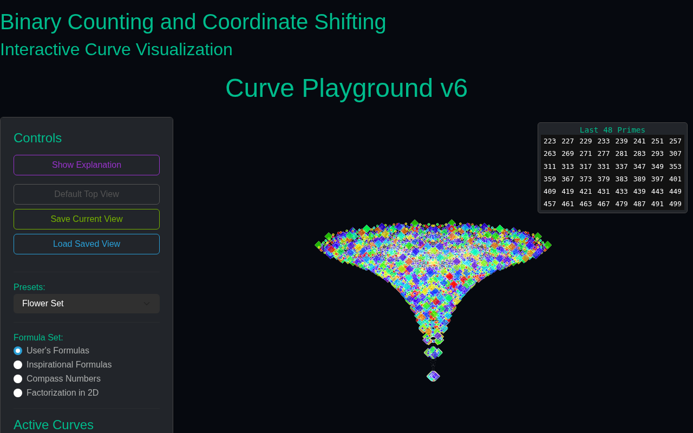
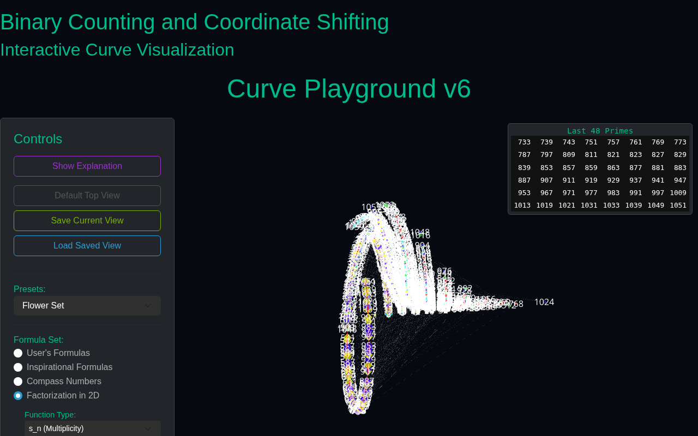
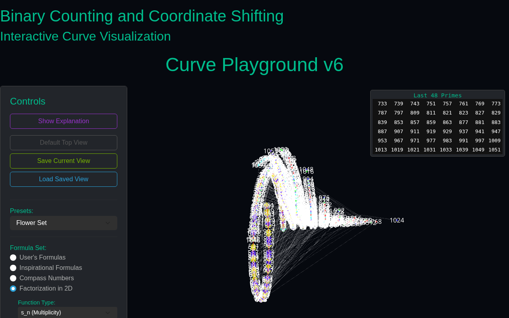
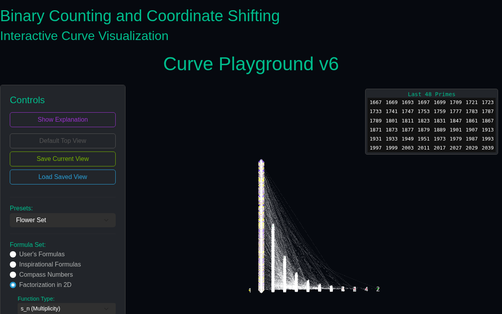
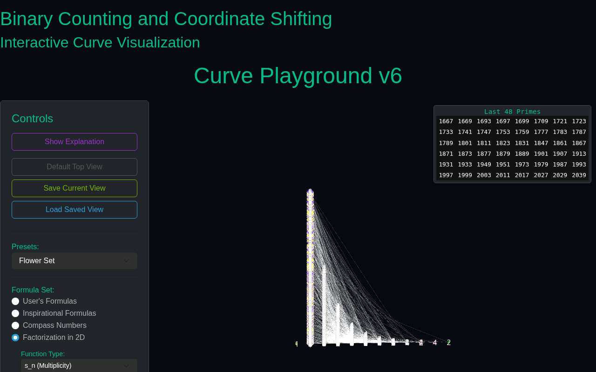
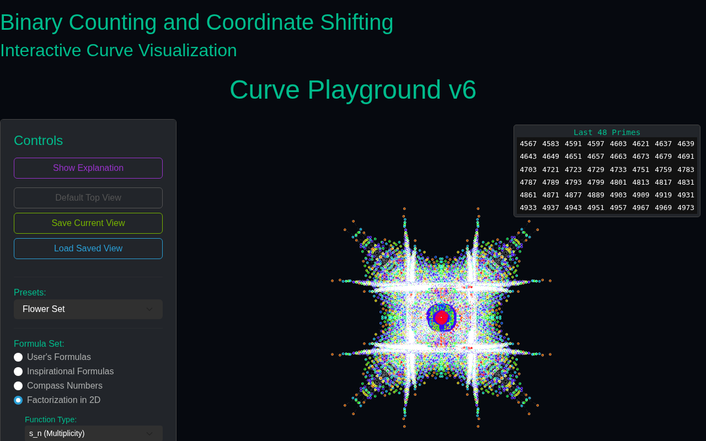
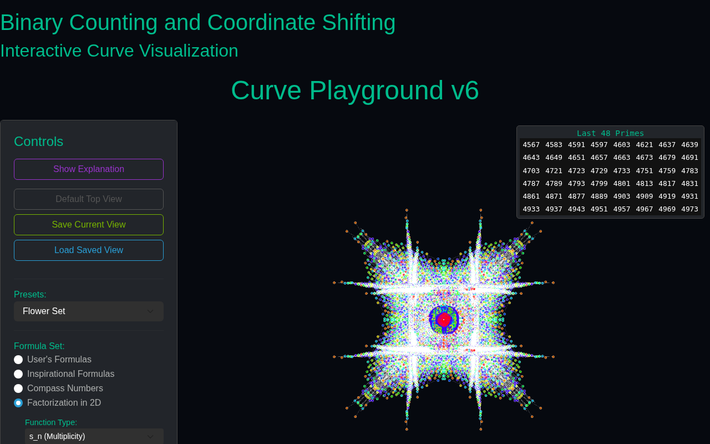
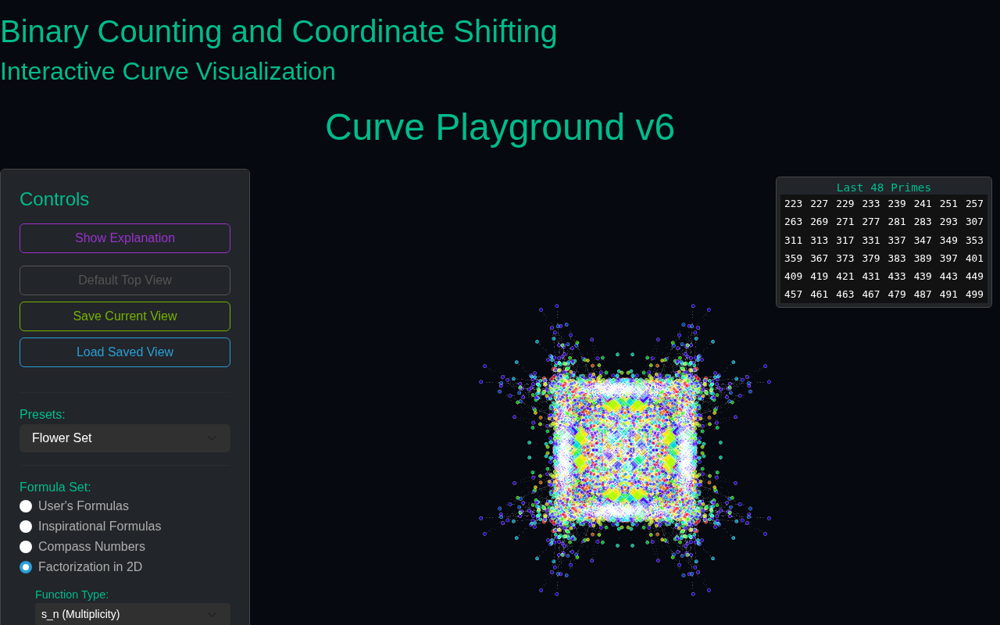
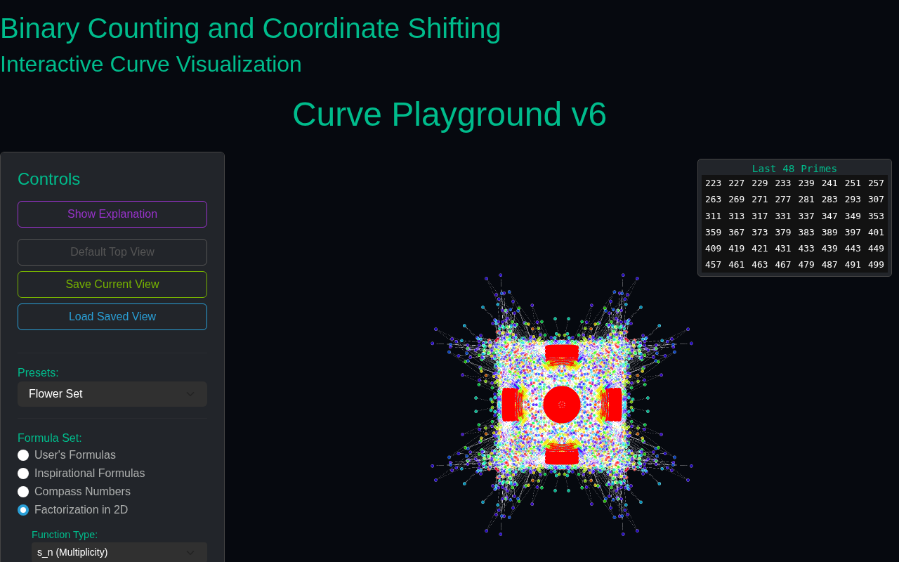

# A walkthrough of the Factorization Lab

> A visual tour of `FactorizationIn2D.html` (the Lab) — four preset scenes, each shown at its starting state and at its final animated state. Captured on 2026-03-15 by `record_views.py`.
>
> **Source:** `QUESTIONS ABOUT PRIMES/000_FACTORIZATION_MAN/recording/`.

## The whole walkthrough, in one animated image

## Startup — the Lab with no data loaded

## Scene 01 — the baseline

The first scene loads a default $(N, T_0, M_c)$ and lets the animation run through its prime-colored iterations.

|  Loaded  |  Final  |
|---|---|
|  |  |

## Scene 02 — mode change

|  Loaded  |  Final  |
|---|---|
|  |  |

## Scene 03 — $M_c = 6$ coloring

With $M_c = 6$, the prime-indexed color cycle lands on a mod-6 palette — the hexagonal spiral appears.

|  Loaded  |  Final  |
|---|---|
|  |  |

## Scene 04 — another preset

|  Loaded  |  Final  |
|---|---|
|  |  |

---

## What you are looking at

Each dot is a natural number $n$ placed at the tip of the complex vector $s_n = \sum_{k=1}^{M_n} \omega^{b_k}$. The dot colors cycle every $M_c$ indices so that you can read the "period" of factorization behavior off the picture. Primes are highlighted; the lines between consecutive primes trace the *prime walk* inside this vector field.

See [factorization notation](#essay-factorization-notation) for the exact definition of $s_n$, $\dot s_n$ and $\ddot s_n$, and [the periodic table for numbers](#periodic-table-for-numbers) for how the Lab was used to build the atoms-of-counting analogy.

Full-resolution `.webm` of the walkthrough is available in the source repo under `QUESTIONS ABOUT PRIMES/000_FACTORIZATION_MAN/recording/walkthrough.webm` (≈37 MB — not bundled here).
